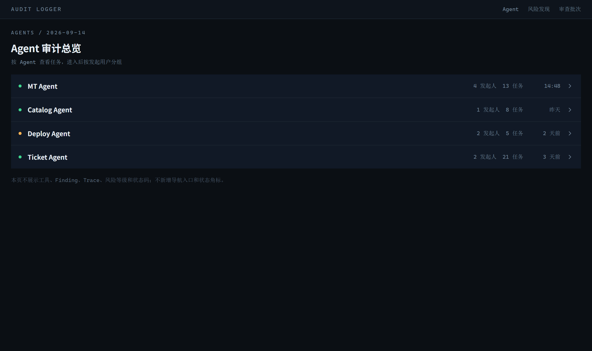
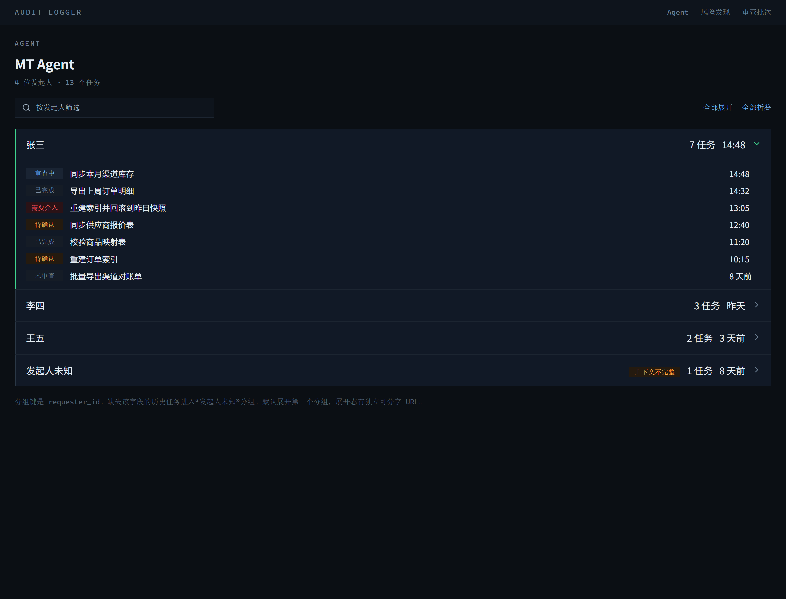
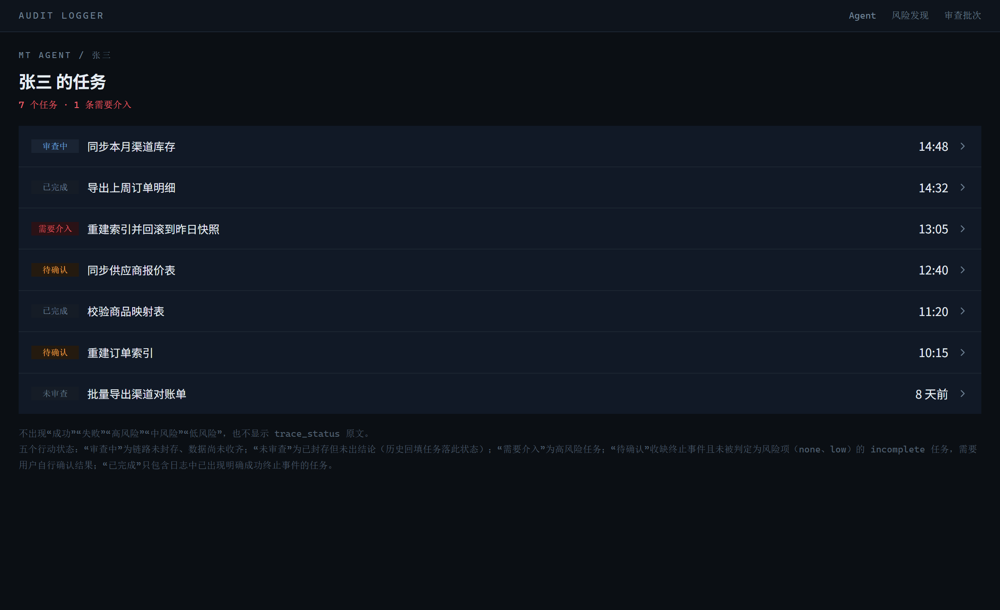
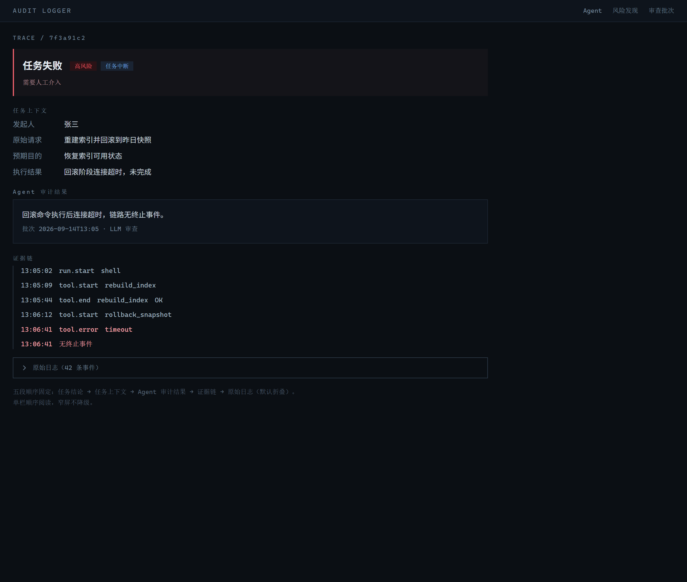

# V1.1 任务级日志审计与 HTTPS 传输设计

> 2026-09-18 规范修订：本文是历史设计记录。当前接入规则以 `docs/agent-audit-log-integration-guide.md` 第 5 节和 `scripts/lib/auditSpec.js` 为准：取消 compat/strict 切换，统一严格校验；Span 字段可选，`expected_purpose` 在 `run.start` 必填。下文旧模式、Span 必填和预期目的可选的描述已被取代。

## 1. 目标

V1.1 将 Audit Logger Agent 的审计对象从单条日志事件提升为完整 Trace 对应的任务。用户和 coding agent 可以看到并批量获取：行为发起人、用户原始请求、Agent 预期目的、最终执行结果、链路状态和风险结论。

本版本同时将生产环境的跨网络日志写入和读取统一切换为 HTTPS，并继续复用现有 Dokploy/Traefik 部署、飞书即时通知和定时审计日报链路。

## 2. 非目标

- 不取消上游 Agent 通过 `POST /v1/ingest` 主动上报日志的模式。
- 不让批量读取 API 承担日志写入职责。
- 不让 Audit Logger 替 coding agent 完成所有批量审计；API 的首要职责是提供已存储日志和证据。
- 不在 V1.1 新结果中继续生成 `critical`。
- 不在应用容器内实现 TLS 证书管理。

## 3. 数据流与调用边界

```text
上游 Agent --HTTPS POST /v1/ingest--> Audit Logger 存储
coding agent --HTTPS GET 批量读取 API--> Audit Logger 返回日志
Audit Logger --高风险 Trace--> 现有飞书 Outbox/通知链路
```

`/v1/ingest` 仅负责写入；批量读取接口仅负责读取。生产公网入口由 Dokploy/Traefik 终止 TLS，容器内部继续监听 `HTTP 0.0.0.0:9320`。

## 4. 任务级日志字段

同一 `trace_id` 的事件需要能够关联以下字段。V1.1 任务级必填字段只有三个：`requester_id`、`original_request`、`agent_result`。

- `requester_id`：行为发起用户的稳定脱敏标识。`run.start` 必填，其他事件可继承或重复携带。
- `original_request`：用户原始请求摘要或正文（遵守现有脱敏和长度限制）。`run.start` 必填。
- `agent_result`：Agent 最终执行结果或失败摘要。`run.final_result`、`run.failed` 必填，前者描述结果，后者描述失败原因。
- `expected_purpose`：Agent 预期完成的任务目的，可选增强字段。缺失不影响事件接收，不使 Trace 变为 `incomplete_context`，也不阻断 `strict` 接入。
- 终止事件和链路证据：成功、失败、异常中断、工具错误、重试、长循环等。

原始 `raw_json` 保留为证据，但 Dashboard 和读取 API 的主要字段必须优先使用结构化字段，调用方不应被迫解析原始 JSON 才能完成基本审计。

字段名固定为 `requester_id`、`original_request`、`agent_result` 和可选的 `expected_purpose`，不得继续使用含义不明确的别名替代。字段在数据库中允许为空以兼容历史事件。新 Trace 不满足事件级条件时的处理分为两类，按 8.2 的接收模式执行：`compat` 模式入库并把 Trace 标记为 `incomplete_context`，`strict` 模式同步拒绝该事件。接入验收依据 `strict` 模式的结果判定。

`expected_purpose` 是 Agent 的预期目的，不是用户诉求的复述。缺失时不得用 `original_request` 顶替，否则任务级审计无法区分"用户要什么"和"Agent 打算做什么"。该能力为可选增强：现有规范已通过 `run.start` 的任务目标和 `llm_intent.input` 承载同类信息，V1.1 不要求所有上游 Agent 为此改造。

### 4.1 实现落点

| 能力 | 落点 |
| --- | --- |
| 字段接收与校验 | `scripts/lib/parser.js` 的 `validateLogEntry`（新增 8.1 的类型/长度规则）、`scripts/lib/auditSpec.js` 的字段白名单 |
| 事件新列与主表 | 建表 SCHEMA 归 `scripts/lib/db.js`（新库直接建全列）；旧库升级的 guarded ALTER 与 `audit_traces` 建表归 `src/db/reviewSchema.js`。两个文件各有一份独立的 `addColumnIfMissing`（`scripts/lib/db.js` 的版本带 `tableExists` 守卫，`src/db/reviewSchema.js` 的版本依赖先建表），不要互相调用或合并 |
| 入库与脱敏兜底 | `src/auditReview/ingestService.js`、`src/adapters/http/ingestRoute.js` |
| Trace 聚合与封存 | 新增 `src/auditReview/traceAggregator.js`，由 `src/auditReview/scheduler.js` 调用 |
| 结论写入与收敛 | 新增 `src/auditReview/traceStore.js`，复用 `src/auditReview/reviewStore.js` 的锁与单调语义 |
| LLM 契约 | `src/auditReview/llmReviewer.js` 的 Prompt 与输出校验 |
| 通知去重 | `src/auditReview/notification.js` 的 `highRiskGroupDedupeKey` 改为 trace 级键，复用同文件的 `dedupeIdentity` 哈希写法 |
| 通知链接生成 | `src/auditReview/visualization.js` 的 `dashboardUrlFor`：飞书卡片里的 Dashboard 绝对 URL 实际由它拼接，Trace 级路由必须在此新增，只改 `feishuCards.js` 不生效 |
| 日报口径 | `src/auditReview/notificationDigestScheduler.js` |
| 读取 API | 新增 `/v1/audit-logs` 路由，复用 `src/adapters/http/app.js` 的 Bearer 鉴权路径 |
| Dashboard | `src/auditReview/dashboardTemplate.js` 与现有路由层，新增 Trace 级路由 |

## 5. Trace 数据模型与聚合

### 5.1 Trace 主表

Trace 级结论不能挂在 Finding 上：一条 Trace 可能没有任何 Finding，也可能有多条 Finding。V1.1 新增独立事实表 `audit_traces`，与 `audit_events` 通过 `(agent_id, trace_id)` 关联，与 Finding 通过 `(agent_id, trace_id)` 弱关联（Finding 允许缺失）。

```sql
CREATE TABLE IF NOT EXISTS audit_traces (
  agent_id TEXT NOT NULL,
  trace_id TEXT NOT NULL,
  requester_id TEXT,
  original_request TEXT,
  expected_purpose TEXT,
  agent_result TEXT,
  context_status TEXT NOT NULL DEFAULT 'unknown',
  trace_status TEXT NOT NULL DEFAULT 'pending',
  risk_level TEXT NOT NULL DEFAULT 'unreviewed',
  risk_reason TEXT,
  evidence_event_ids TEXT,
  first_event_at TEXT,
  last_event_at TEXT,
  ingested_watermark TEXT,
  event_count INTEGER NOT NULL DEFAULT 0,
  review_input_sampled INTEGER NOT NULL DEFAULT 0,
  omitted_event_count INTEGER NOT NULL DEFAULT 0,
  sealed_at TEXT,
  sealed_reason TEXT,
  review_version INTEGER NOT NULL DEFAULT 0,
  first_reviewed_at TEXT,
  last_reviewed_at TEXT,
  revised_at TEXT,
  revision_count INTEGER NOT NULL DEFAULT 0,
  review_error INTEGER NOT NULL DEFAULT 0,
  review_retry_count INTEGER NOT NULL DEFAULT 0,
  model TEXT,
  prompt_version TEXT,
  input_hash TEXT,
  updated_at TEXT NOT NULL,
  PRIMARY KEY (agent_id, trace_id)
);

CREATE INDEX IF NOT EXISTS idx_audit_traces_risk ON audit_traces(risk_level, last_event_at);
CREATE INDEX IF NOT EXISTS idx_audit_traces_seal ON audit_traces(sealed_at, last_event_at);
CREATE INDEX IF NOT EXISTS idx_audit_traces_status ON audit_traces(trace_status, last_event_at);
CREATE INDEX IF NOT EXISTS idx_audit_traces_requester ON audit_traces(agent_id, requester_id, last_event_at);
CREATE INDEX IF NOT EXISTS idx_audit_traces_agent_recent ON audit_traces(agent_id, last_event_at DESC, trace_id);
```

`idx_audit_traces_agent_recent` 服务 11.1 读取 API 的主访问路径（按 `agent_id` 过滤 + `last_event_at DESC, trace_id` 排序）。不能复用 `idx_audit_traces_requester`：后者第二列是 `requester_id`，只有同时按发起人等值过滤时才走得上，按 Agent 翻页会退化成全表扫描加排序。

枚举取值（由应用层校验，沿用现有迁移风格，不在 SQLite 加 CHECK 约束）：

| 列 | 取值 |
| --- | --- |
| `context_status` | `complete`、`incomplete_context`、`unknown` |
| `trace_status` | `pending`、`success`、`failed`、`interrupted`、`incomplete` |
| `risk_level` | `unreviewed`、`none`、`low`、`medium`、`high` |
| `sealed_reason` | `terminal_event`、`idle_timeout`、`waiting_user_timeout`、`backfill` |

`pending` 与 `unreviewed` 只表示"结论尚未收敛"，不是风险等级；正式判定只能写入 6.2 的四个 `risk_level`。`backfill` 表示该行由 5.6 的历史回填写入，数据已收齐但从未送审。

### 5.2 事件关联、新增列与扫描游标

- 关联键固定为 `(agent_id, trace_id)`；`trace_id` 只要求在同一 `agent_id` 内唯一。不同 Agent 使用相同 `trace_id` 时分别建模，不合并，也不视为冲突。
- `audit_events` 新增列：`ingested_at`（服务端入库时间）、`requester_id`、`original_request`、`expected_purpose`、`agent_result`、`redaction_hits`。全部通过 guarded ALTER 追加，旧库可平滑升级，旧行保持 NULL。
- 扫描游标使用 `(ingested_at, id)`，不沿用 `ts`。扫描条件为 `ingested_at > @watermark OR (ingested_at = @watermark AND id > @lastId)`，排序为 `ORDER BY ingested_at ASC, id ASC`。
  - 原因：`ts` 由上游提供，可能重复、乱序或事后补报；用 `ts` 做游标会漏事件或重复处理。`ts` 只用于证据排序和展示。
- 游标状态存放在**新表** `audit_trace_scan_cursor`，不复用现有 `audit_ingest_cursors`：

```sql
CREATE TABLE IF NOT EXISTS audit_trace_scan_cursor (
  cursor_name TEXT PRIMARY KEY,
  last_ingested_at TEXT,
  last_event_id INTEGER,
  updated_at TEXT NOT NULL
);

CREATE INDEX IF NOT EXISTS idx_audit_events_ingested ON audit_events(ingested_at, id);
```

  - 不能混用 `audit_ingest_cursors` 的原因：该表主键是 `(agent_id, file_path)`，游标字段是 `offset_bytes`（配合 `file_mtime_ms`、`file_size_bytes`），语义是**spool 文件的字节偏移**，属于 ingest 侧。审查扫描的游标语义是"已处理到哪条入库记录"，两者计量单位不同，塞进同一张表会让两套推进逻辑互相破坏。
  - `audit_trace_scan_cursor` 是单行表（`cursor_name` 固定为 `trace_aggregation`），保留主键列是为了后续可能的多消费者场景，不需要额外分区。
  - `idx_audit_events_ingested` 是扫描条件的支撑索引，缺它时每轮调度都会全表扫描 `audit_events`。
- 证据排序统一为 `ORDER BY ts ASC, id ASC`，同一毫秒内按自增主键定序。
- 迟到事件（`ts` 早于已处理水印）只要 `ingested_at` 是新的就会被扫描到，从而进入对应 Trace 重新聚合；水印只随 `ingested_at` 前进，不会被迟到事件回退。

### 5.3 生命周期与完成判定

审查对象从"时间窗口内的候选事件"改为"Trace"。时间窗口只保留为调度节拍，不再作为审计边界。

`sealed_at` 非空表示该 Trace 的**数据已收齐**，可以进入审查；它不等于"已经出了结论"，后者由 `review_version > 0` 表示（两个轴的完整语义见 6.5）。在封存之前 `trace_status=pending`、`risk_level=unreviewed`，不参与风险统计、不发通知、不计入告警；封存后但尚未出结论时同样不参与这些统计。

封存（seal）条件按序判定，命中第一条即封存：

| 优先级 | 条件 | `sealed_reason` |
| --- | --- | --- |
| 1 | 出现终止事件（`run.final_result`、`run.failed`） | `terminal_event` |
| 2 | 最后一跳是 `run.waiting_user`，且超过 `waitingUserTimeoutMinutes`（默认 1440 分钟，可配置）仍无 `run.resume` | `waiting_user_timeout` |
| 3 | 无终止事件，最后一跳**不是** `run.waiting_user`，且最后一条事件早于 `idleTimeoutMinutes`（默认 60 分钟，可配置） | `idle_timeout` |

第 3 行的"最后一跳不是 `run.waiting_user`"是必需的排除条件，不是冗余表述。缺它时优先级 2 永远不可达：等待用户的 Trace 在第 60 分钟就先命中优先级 3 被封存为 `idle_timeout`，1440 分钟的阈值没有任何机会生效，用户还没来得及回话，任务就已经在列表里显示为终态。加上排除条件后，等待用户期间该 Trace 保持未封存，底层兼容状态为 `in_progress`；首次未审查记录不进入新版工作台，直到真正超时。

`waiting_user_timeout` 保留为独立的 `sealed_reason` 取值，用途是排障时区分"用户没回"和"链路断了"；它不导向任何风险等级，超时封存后按 6.3.1 正常判定（通常落到"无终止事件且无异常证据"，即 `incomplete + none`，展示为"结果待核实"）。

终态结论由完整 Trace 一次性判定，不由窗口片段判定：

- **封存即送审**：封存意味着该 Trace 的数据已经收齐，不会再有新事件，此时直接进入审查队列，不再设最少事件数门槛。
  - 不设 `minStableEventCount` 之类门槛的原因：封存条件本身已经保证了数据完整性，再叠加事件数门槛会让只有一条孤立 `run.start` 的 Trace 被封存却永远不满足送审条件，`trace_status` 永久停在 `pending`，在任务列表里变成一条永远"审查中"、无法清理也无法确认的僵尸记录。
- 审查输入是该 Trace 在当前水位下的全部事件，不按时间窗口切分。
- `action_state` 按 6.5 的两个轴（`sealed_at`、`review_version`）派生；未封存 Trace 的行动状态为 `in_progress`，“审查中”仅为旧界面兼容文案，新版工作台不展示该实时进度。
- 封存后如果又收到该 Trace 的迟到、乱序或补报事件，Trace 解除封存并重新聚合：把新事件与已有事件合并成完整事件集合后重新送审，`review_version` 递增，结论按 6.3.3 的固化规则收敛。
- 迟到事件是正常的接入时序现象，不记为异常或缺陷数据；它触发的是**重审**，不是给同一次判定追加证据。
- 重审不产生第二次高风险通知，通知仍按第 10 节每 Trace 只发送一次。

### 5.4 并发、重复审查与结论收敛

- 单 Trace 粒度互斥：审查前按 `(agent_id, trace_id)` 获取现有 `audit_review_locks` 中的锁，同一 Trace 不并发审查。
- 水位与版本：`input_hash`（事件 ID 集合与内容哈希）**只在审查成功后落库**，失败路径不写。跳过条件是 `input_hash` 相同 **且** `review_error = 0`，两个条件同时满足才跳过，因此重复调度、进程重启和扫描重叠都不会产生重复结论。
  - 两个条件缺一不可：若送审时就写 `input_hash`，一次 LLM 失败后事件集合没有变化、hash 也没有变化，下一轮会因 hash 相同被直接跳过，7.3 承诺的"下一轮重试"永远不会发生，该 Trace 会带着 `review_error=1` 永久卡住。重试次数由 7.3 的 `maxInvalidOutputRetries` 封顶，不会无限重试。
- 结论收敛规则：
  1. `risk_level` 单调上升，沿用现有 `max_severity` 的单调语义。
  2. 已是 `high` 的 Trace 不因任何后续重审降级，`trace_status` 和 `risk_level` 均不得改写为更低等级。
  3. 迟到、乱序或补报事件到达时解除封存，把新事件与已有事件合并成完整集合后重新送审；`review_version` 递增，`revised_at` 更新。
  4. 结论变更写入审查原因，保留 `review_version` 历史，不覆盖旧证据。
  5. 重审不产生第二次高风险通知，通知仍按第 10 节每 Trace 只发送一次。
- 与现有时间窗口审查并存期间，Trace 级结论与 Finding 级结论可能不一致。以 Trace 级结论为准：窗口审查只产出 Finding 证据，Finding 不再单独决定通知与列表行动状态。
- LLM 调用失败、超时或返回结构非法时，保留既有结论不降级，写入 `review_error=1` 并记录错误原因，留待下一轮重试；不得写入"判定成功"之类的假设结论。

### 5.5 单 Trace 事件上限与截断策略

- `maxEventsPerTrace`（默认 2000，可调初始值）限制单次 LLM 输入的事件数。
- 超出上限时按**优先级填预算**采样：把事件分入下列四个优先级桶，从高到低依次填入 `maxEventsPerTrace` 预算，填满即停；被截断的那个桶内部按 `ts ASC, id ASC` 确定性丢弃尾部。采样规则固定写入文档与代码注释，保证同一 Trace 多次审查得到一致的终态结论。

| 优先级 | 事件 |
| --- | --- |
| 1 | `run.start`、全部终止事件（`run.final_result`、`run.failed`）、`run.waiting_user`、`run.resume` |
| 2 | 全部错误、失败、超时、重试和循环类事件 |
| 3 | 每个 `span_id` 的首末事件 |
| 4 | 其余事件，按 `ts ASC` 保留头尾两段，中间省略 |

- 必须是填预算制而不是"逐条规则无条件保留"：优先级 3 在 span 数量大的 Trace 里会自己撑爆预算（1500 个 span 就是 3000 条首末事件，已超过默认上限 2000），此时原先只管"其余"的优先级 4 规则无处生效，采样结果反而不确定。纳入预算制后，任何事件分布下的输出都是确定且有界的。
- 优先级 1 的事件量与 Trace 的 run 层级数成正比，实践中远小于预算；若极端情况下优先级 1 自身就超过预算，仍按桶内 `ts ASC, id ASC` 截断，并按下一条标记为采样。
- 采样仅作用于 LLM 送审输入。落库的 `audit_traces.review_input_sampled=1` 和 `omitted_event_count` 描述的是"本次审查输入被采样"，不是日志被丢弃或读取接口被截断。
- 采样标记传递到读取 API 响应、任务详情页和飞书卡片，展示"该 Trace 事件过多，审查结论基于采样证据"。读取 API 和 Dashboard 仍返回完整事件集合。
- **采样后允许给出终态结论**，因为高信号事件（终止、错误、循环、首末）已被完整保留。但若采样后仍无法确定终止状态，只能判定为 `incomplete`，不得判定为 `success`。

### 5.5.1 配置默认值的性质

下表区分哪些默认值是**产品规则**（改动会改变审计语义和用户可见结论，需要重新走产品确认），哪些是**可调初始值**（V1.1 的起始取值，上线后依据真实 Trace 时长和事件分布校准，不需要重新确认语义）。实现时不要把可调初始值写成常量硬编码，全部通过 `config.json` 暴露。

| 配置项 | 默认值 | 性质 | 说明 |
| --- | --- | --- | --- |
| `idleTimeoutMinutes` | 60 | 可调初始值 | 只影响"多久算静默"，不改变判定结论的种类 |
| `waitingUserTimeoutMinutes` | 1440 | 可调初始值 | 等待用户的容忍时长；超时后按 `incomplete + none` 判"结果待核实"，不发告警，因此调大调小不会放大误报 |
| `maxEventsPerTrace` | 2000 | 可调初始值 | 只影响 LLM 送审输入，不影响读取 API 和 Dashboard 的完整返回 |
| `traceDays` | 30 | 可调初始值 | 保留期，依据 5.7 的容量测算与人工响应周期 |
| `highRiskTraceDays` | 90 | 可调初始值 | 高风险 Trace 的延长保留期 |
| `maxTracesPerAgent` | 2000 | 可调初始值 | 单 Agent 容量安全阀 |
| `/v1/audit-logs` 的 `limit` | 默认 50 / 上限 200 | 可调初始值 | 上限含义见 11.1，不是返回条数保证 |
| `maxInvalidOutputRetries` | 2 | 可调初始值 | LLM 非法输出的重试上限 |
| 6.1 的 `trace_status` 四个取值 | — | **产品规则** | 改动即改变审计语义 |
| 6.2 的 `risk_level` 四个档位 | — | **产品规则** | 同上 |
| 6.3.2 的合法组合表 | — | **产品规则** | 同上 |
| 6.5 的 `action_state` 五个取值与文案 | — | **产品规则** | 用户直接可见 |
| 第 10 节"仅 `high` 发送通知" | — | **产品规则** | 通知门槛 |

### 5.6 历史数据回填

迁移分三步，均可重复执行：

1. **建表与加列**：创建 `audit_traces`、`audit_trace_scan_cursor` 和全部索引，并为 `audit_events` 补充 5.2 的新列。沿用现有 `addColumnIfMissing` / `ensureRuntimeSchema` 的 guarded ALTER 模式。
2. **回填主表**：按 `(agent_id, trace_id)` 对 `audit_events` 做全量聚合，写回填行：
   - `context_status`：按三个必填任务字段（`requester_id`、`original_request`、`agent_result`）判定，齐全为 `complete`，部分缺失为 `incomplete_context`，全部缺失为 `unknown`；可选字段 `expected_purpose` 不参与判定。
   - 事实字段照常聚合：`first_event_at`、`last_event_at`、`event_count` 以及三个任务字段。
   - **结论字段一律写"未审查"态**：`trace_status='pending'`、`risk_level='unreviewed'`、`review_version=0`、`review_error=0`、`review_retry_count=0`。
   - **回填时直接封存**：`sealed_at` 写该 Trace 最后一条事件的时间，`sealed_reason='backfill'`。历史数据不会再有新事件，封存是事实陈述。
3. **游标初始化**：回填完成后把 `audit_trace_scan_cursor` 置于回填水位，仅增量处理新事件。

历史数据**不触发 LLM 审查**，保持"未审查"状态可见即可。V1.1 的新审查规范只适用于回填水位之后的新数据。这样回填是纯粹的结构化整理，可以反复执行且无副作用，也不会为历史数据付出 LLM 成本。

两个容易写错的点：

- **不能把 `risk_level` 回填为 `none`。** `none` 是"正常完成且没有异常"的正式无风险判定，而回填并没有做出这个判定。写 `none` 会与 6.3.1 的确定性规则冲突（例如历史上带 `run.failed` 的 Trace 按规则 2 应是 `failed + high`），并被 6.3.2 的写入拦截挡下，迁移第二步直接失败。`pending + unreviewed` 本身就是 6.3.2 的合法组合，既表达了"尚未判定"，又天然不参与风险统计、不发通知、不计入告警。
- **不能把 `sealed_at` 留空。** 留空会与 5.7 的"未封存的 Trace 不按年龄删除"守卫叠加，使历史回填数据变成永远清理不掉的僵尸行。

回填期间应用可读写：新事件照常入库并直接进入增量聚合；回填批量更新不回退已有 Trace 的 `risk_level`、`review_version` 和 `sealed_at`。若某条历史 Trace 在回填后又收到迟到事件，按 5.3 正常解除封存并进入新规范的审查流程。

### 5.7 保留策略

保留策略的计量单位从事件改为 **Trace**：保留 `last_event_at` 落在保留窗口内的 Trace 及其全部证据事件，事件不再单独按年龄或条数裁剪。

| 配置项 | 默认值 | 作用 |
| --- | --- | --- |
| `traceDays` | 30 | 已封存 Trace 及其全部事件的保留天数 |
| `highRiskTraceDays` | 90 | `risk_level=high` 的 Trace 单独延长保留 |
| `maxTracesPerAgent` | 2000 | 单 Agent 的 Trace 容量上限，超出时按 `last_event_at` 从旧到新裁剪 |

取值依据：

- **下限由功能决定，不是由存储决定。** `unconfirmed`（"结果待核实"）是一个要求真人回来确认结果的行动状态，保留期必须覆盖人的响应周期，否则用户周五收到通知、周一回来点进去时证据已被清理，该状态就失去意义。跨周末需要 3 天，跨假期需要 7 天以上，**7 天是绝对下限，14 天是舒适下限**。日报里链接回去的任务同样受此约束。
- **上限由存储决定。** 实测单条事件 `raw_json` 平均 309 字节、最大 377 字节，加上其余列与索引开销后单行约 700 字节至 1 KB。按 1 KB 估算：1 千条/天规模下 30 天约 30 MB，1 万条/天约 300 MB，5 万条/天约 1.5 GB。SQLite 在前两档完全无压力，到 1.5 GB 以上才需要重新评估。
- `traceDays=30` 同时满足上述两侧，并覆盖一个自然月的复盘周期。`highRiskTraceDays=90` 单独延长的理由是 `needs_attention` 正是最不能丢的那批数据，且 90 天与现有 `llmUsageDays: 90` 属于同一档，符合既有配置惯例。
- `maxTracesPerAgent=2000` 是容量安全阀而非常规路径：按平均每条 Trace 20 个事件估算约合每 Agent 4 万条事件、40 MB。天数管正常情况，容量管某个 Agent 突然刷量的情况。

**必须删除对旧事件级配置的沿用**：`eventsHours: 48` 和 `maxEventsPerAgent: 200` 不得与上述配置并存。两套规则同时生效时 48 小时会先赢，Trace 保留期形同虚设；而每 Agent 只留 200 条事件的配额，会在 Trace 封存之前就把证据裁掉，使 `evidence_event_ids` 指向已删除的行。迁移时从 `config.json` 移除这两项。

清理守卫与边界：

- **未封存或未审查的 Trace 及其事件不按年龄删除**（`sealed_at IS NULL`，或 `sealed_at` 非空但 `review_version=0` 且非 `backfill`）。该守卫天然自限，不会造成积压：按 5.3，任何 Trace 最多 60 分钟就会被 `idle_timeout` 封存；回填数据则已按 5.6 带 `sealed_reason='backfill'` 封存，同样可被正常清理。
- **审查失败的例外出口**：上一条守卫必须有出口，否则一条封存后因 LLM 持续失败而始终未出结论的 Trace（`review_version` 永远是 0、又不是 `backfill`）会被永久保留。规则是——`maxInvalidOutputRetries` 重试耗尽后，该 Trace 不再受守卫保护，按 `traceDays` 正常清理。
  - 判定依据必须是持久化的重试计数 `audit_traces.review_retry_count`（每次审查失败递增，成功后归零），不能靠内存状态，否则进程重启后计数归零、守卫重新生效，僵尸行依旧清不掉。`review_error` 只是 0/1 的当前状态标志，无法表达"已经失败过几次"，两者不能互相替代。
  - 清理前必须在 `/health` 暴露"审查失败待清理"的 Trace 计数。审查连续失败是系统故障信号而不是正常状态，静默清掉会把故障现场一并抹去；先可见、再清理，排障时才知道曾经发生过什么。
  - 该出口只针对"重试耗尽仍未出结论"。仍在重试窗口内的 Trace 继续受守卫保护，不会因为恰好撞上清理窗口而丢失证据。
- **孤儿事件清扫**：没有对应 `audit_traces` 行的事件（回填水位之前的遗留、或聚合尚未跟上的新事件）按 `traceDays` 单独清理，否则这类事件会永久累积。清扫需给聚合留出安全边界，只删除 `ingested_at` 早于当前扫描游标的孤儿事件。
- Trace 记录删除时同步清理对应 Finding 证据引用；已落库的日报数据不清算、不改写。
- 保留期内 `audit_traces` 是 Dashboard 与批量读取 API 的主数据源；事件表只作为证据明细。

## 6. 链路状态与风险模型

### 6.1 链路状态

`trace_status` 仅允许：

- `success`：有明确成功终止事件。
- `failed`：有明确失败终止事件。
- `interrupted`：没有正常终止，且存在任务中断证据。
- `incomplete`：缺少终止事件，但现有链路没有循环、调用失败或异常中断证据，无法确认任务最终结果。

### 6.2 风险等级

`risk_level` 仅允许：

- `none`：正常完成且没有异常。
- `low`：最终完成，或链路缺终止事件但无失败证据，且仅有轻微异常或普通审计提示。`low` 不表示任务完成，缺终止事件的 `low` 仍属于 `unconfirmed`。
- `medium`：出现工具错误或长时间循环，且日志中已经出现明确的成功终止事件，任务最终完成。超时只有作为工具错误证据的一部分时计入；单独的重试不自动升级为中风险。判定依据是已经发生的日志事实，不是对后续能否恢复的推测。
- `high`：任务失败或任务中断；必须人工介入。

缺失终止事件本身不能升级为高风险：

- `incomplete` 且无异常证据 → `risk_level=none`，不通知。这包括等待用户超时未回复的场景：长时间未回复是正常等待，不是异常中断。
- 缺失终止事件且存在循环、调用失败或异常中断证据 → `interrupted + high`，发送通知。
- 明确失败终止事件 → `failed + high`，发送通知。

`medium` 描述的是“过程出现异常，但日志证明最终完成”，必须以明确成功终止事件为前提。`incomplete` 描述的是“缺少终止事件，无法确认最终结果”，因此：

- `incomplete` 不允许搭配 `medium`：缺少终止事件时无法证明任务完成，不存在“可恢复的中风险”这一结论。
- 日志审计是后审行为。日志发送完毕、审计开始时任务已经结束，是否恢复必须由日志中的实际终止结果确定，不能由 LLM 推测 Agent 未来能否恢复。
- 风险等级与链路状态是两个独立维度，但二者的合法组合受 6.3.2 约束，不得用其中一个反推另一个。

最终结论由 LLM 基于完整 Trace 和结构化证据判断，但必须先按 6.3.1 的确定性规则分流：规则已给出唯一结论的场景不再交 LLM，LLM 只处理规则未覆盖的歧义。高风险一旦在后审中确定，整条 Trace 固化为高风险，不因后续解释降级。高风险工具或权限审计结果作为证据和独立结论展示，不单独把成功任务升级为高风险。

### 6.3 状态判定优先级与边界场景

`trace_status` 与 `risk_level` 的判定必须唯一，因此固定以下优先级。LLM 只在明确规则未覆盖时介入，不得推翻明确规则。

#### 6.3.1 确定性规则（优先于 LLM）

| 优先级 | 条件 | 结论 |
| --- | --- | --- |
| 1 | 出现 `run.final_result`，且无工具错误、超时、重试或长循环证据 | `success + none` |
| 2 | 出现 `run.failed` | `failed + high` |
| 3 | 规范化后 `status = CANCELLED` 的终止事件 | `failed + high`（任务被取消，结果未达成，需人工介入） |
| 4 | 存在工具错误或长循环证据，且最终出现 `run.final_result` | `success + medium` |
| 5 | 出现 `run.final_result`，仅有轻微异常（单次非关键重试、可忽略告警，不构成工具错误或长循环） | `success + low`，由 LLM 判定 |
| 6 | 无终止事件，无循环或调用失败证据 | `incomplete + none`，仅在有普通审计提示时允许升级为 `low`，由 LLM 判定 |
| 7 | 无终止事件，存在循环、调用失败或异常中断证据 | `interrupted + high` |

本表对"出现终止事件"的场景**不是穷尽二分**。第 1、4 行覆盖两端（完全无异常、构成工具错误或长循环），第 5 行覆盖中间地带——异常存在但不足以构成工具错误或长循环。实现时不要把第 1、4 行写成 if/else 二分支，否则 6.2 与 6.3.2 都允许的 `success + low` 将没有任何产出路径。第 5、6 行是全表仅有的两处需要 LLM 介入的地方，见 7.3。

补充约束：

- `run.waiting_user` 不单独导向任何风险等级：无论是否存在 `run.resume`，都回到本表按终止事件与异常证据继续判定。等待用户超时只影响 5.3 的封存时机与 `sealed_reason`，不影响结论。超时封存的 Trace 通常落到第 6 行的 `incomplete + none`，在任务列表中显示为"结果待核实"——用户长时间未回复自己的 Agent 是正常等待，不是异常中断，不应触发"需要人工介入"的高风险告警。
- 子 Agent 未结束时，父 Trace 不因该子 Span 缺失终止事件而判 `high`；只有当子 Span 缺失终止事件**且**该 Trace 已按 5.3 封存时，才按第 7 行判定为 `interrupted + high`。子 Span 仍在进行且 Trace 未封存时保持 `pending`。
- 工具错误或长循环一律先按第 4、7 行分流：日志中已出现明确成功终止事件、证明最终完成的归 `medium`；缺少终止事件且存在循环或调用失败证据的归 `high`。超时只有在明确属于工具错误时纳入第 4 行，单独的重试不自动升级。这里判断的是日志中已经发生的事实，不允许用"Agent 应该能恢复"这类推测降低等级，也不存在"工具错误必然等于任务中断"。
- `low` 只用于最终完成（第 5 行）、或链路缺终止事件时出现普通审计提示（第 6 行）的场景，由 LLM 判定；`low` 不得与任何循环、调用失败或异常中断证据同时出现。缺终止事件的 `low` 搭配 `incomplete`，最终完成场景的 `low` 搭配 `success`。
- 缺失终止事件不能升级为 `high` 的唯一例外是第 7 行：必须存在循环或调用失败证据。

#### 6.3.2 允许的终态组合

下表为合法组合全集，超出该表的组合视为缺陷数据，必须拦截写入并在 `/health` 中计数：

| `trace_status` | 允许的 `risk_level` |
| --- | --- |
| `success` | `none`、`low`、`medium` |
| `failed` | `high` |
| `interrupted` | `high` |
| `incomplete` | `none`、`low` |
| `pending` | `unreviewed` |

因此缺终止事件时只允许 `none` 或 `low`：`incomplete + medium` 非法（缺终止事件无法证明任务完成，中风险必须以成功终止事件为前提），`incomplete + high` 非法（缺终止事件且存在失败证据时必须判为 `interrupted`）。

`/health` 的非法组合计数采用**查询时实时统计** `audit_traces`，不新建计数器表、不维护累加字段。理由：没有新增写路径，计数随数据自愈（脏数据被修复或清理后计数自然归零），并且它回答的是"库里现在还有没有脏数据"这个真正需要排障的问题，而不是"历史上曾经写坏过多少次"。写入拦截是第一道防线，实时统计是发现拦截漏网的第二道防线。

#### 6.3.3 高风险固化规则

- `high` 一旦写入即固化：后续重审不得改写 `risk_level`，也不得把 `trace_status` 从 `failed`/`interrupted` 改写为 `success` 或 `incomplete`。
- 固化针对整条 Trace 的后审结论，跨越多次重审始终有效；重审时新证据与已有证据统一归并，完整证据在 Dashboard 和 API 中保留，飞书只按第 10 节发送一次高风险通知。
- 固化状态必须持久化在 `audit_traces`，不能只靠内存标记，保证重启和并发调度后语义不变。

### 6.4 critical 兼容

数据库保留历史 `critical` 数据。V1.1 新审查不生成 `critical`。

映射的作用域**限定在 Finding 读取路径**：旧 Finding 详情页、旧日报的历史时段数据、`/query` 返回的 Finding 相关字段，这些位置把历史 `critical` 显示为 `high`。

Trace 层既不产生也不映射 `critical`：`audit_traces.risk_level` 的取值只有 5.1 枚举的五个，历史 Trace 按 5.6 回填为 `unreviewed` 而非任何风险档位。不要把 Finding 的 `critical→high` 映射投射到 Trace 层——否则同一条历史任务会在 Finding 视图显示 `high`、在 Trace 视图显示"未审查"，两个视图给出互相矛盾的结论。正确的解释是：Finding 是旧模型下的事件级证据，Trace 是新模型下的任务级结论，历史数据只有前者、没有后者。

### 6.5 任务列表展示状态

Dashboard 任务列表不直接展示 `risk_level` 或 `trace_status`，而是确定性派生一个行动状态 `action_state`。

派生输入是**两个独立的轴**，不是 `trace_status` 单值：

- `sealed_at`：数据是否已收齐（5.3 的封存）。
- `review_version`：是否已经出过结论。

| `action_state` | 判定条件 | 中文文案 | 含义 |
| --- | --- | --- | --- |
| `in_progress` | `sealed_at IS NULL` | 审查中（旧界面兼容） | 数据尚未收齐；新版按下述后审范围决定是否展示记录 |
| `unreviewed` | `sealed_at` 非空且 `review_version = 0` | 未审查 | 数据已收齐但尚未出结论；历史回填数据全部落在此状态 |
| `needs_attention` | `risk_level = high` | 需要关注 | 审计发现需要人工核查的问题，不表示已有处理记录 |
| `unconfirmed` | `trace_status = incomplete` 且 `risk_level ∈ {none, low}` | 结果待核实 | 链路缺终止事件，但审计未判定为风险项，结果无法确认 |
| `resolved` | `trace_status = success` 且 `risk_level ∈ {none, low, medium}` | 已完成 | 已完成；包含无风险、低风险和中风险 |

判定按上表顺序执行：先看两个轴，再看风险等级。`risk_level = high` 在已审查的 Trace 中优先级最高，已被判定为高风险的 Trace 不进入 `unconfirmed`，直接进入 `needs_attention`；中风险必须以成功终止事件为前提，不可能是 `incomplete`，因此只出现在 `resolved`。`unconfirmed` 只收"缺终止事件且未被判定为风险项（`none`、`low`）"的任务。

为什么要拆成两个轴：原设计用 `trace_status=pending` 同时代理"数据是否收齐"和"是否已审查"两件独立的事，导致两个无解场景——被 `idle_timeout` 封存但因故未送审的 Trace 会永久停在"审查中"，无法清理也无法确认；5.6 的历史回填数据没有任何合法状态可落（写 `none` 会被 6.3.2 拦截，留 `pending` 又与"已封存"矛盾）。拆开之后，"已封存 + 未出结论"是一个显式且可表达的状态，两个问题同时消失。

`action_state` 是只读派生值，不写回数据库，也不作为通知门槛。通知门槛仍然只看 `risk_level = high`。`in_progress` 与 `unreviewed` 都不是风险档位，不参与告警统计。

2026-09-17 确认的新版 Dashboard 是事后审计工作台，不展示实时执行进度。上表保留底层五值派生契约和 API 兼容性；首次未封存且未审查的 `in_progress` 不进入新主列表及其统计，不能将其渲染为“执行中”或“等待用户”。已封存未审查、历史回填记录仍可查询，明确标注“未审查”及历史来源，不得当作无风险。

新版列表使用“需要关注 / 结果待核实 / 已完成 / 未审查”文案。迟到事件引起重审时，已有审计结论仍应可见，并注明重审情况和已有结论的时间、版本，不因重新等待封存而隐藏结论或改成实时执行状态。该展示规则不改写底层 `action_state`、风险判定、通知门槛或保留期。超时封存并不证明执行完成，缺少终止证据时仍可后审并显示“结果待核实”，不得凭日志缺失推断成功或失败。

## 7. LLM 审查输入输出契约

### 7.1 输入契约

送审输入固定为该 Trace 在当前水位下的完整事件集合，字段白名单固定如下，其他字段不得进入 Prompt：

```json
{
  "agent_id": "mt-agent",
  "trace_id": "trace-123",
  "requester_id": "user-001",
  "original_request": "…",
  "expected_purpose": "…",
  "agent_result": "…",
  "context_status": "complete",
  "sealed_reason": "terminal_event",
  "review_input_sampled": false,
  "omitted_event_count": 0,
  "event_count": 42,
  "events": [
    {
      "event_id": 10231,
      "ts": "2026-09-14T13:05:02.000Z",
      "event": "run.start",
      "span_id": "s-1",
      "parent_span_id": null,
      "tool_name": "shell",
      "status": "OK",
      "duration_ms": null,
      "error_message": null,
      "result_summary": "开始重建索引",
      "llm_intent": {
        "input": "用户要求重建索引并回滚",
        "output": "计划先重建再回滚"
      }
    }
  ]
}
```

`events` 是本节的 LLM 送审输入，已按 5.5 采样，顺序为 `ts ASC, id ASC`。这只影响 Prompt 内容，不影响落库日志、读取 API 或 Dashboard 的完整返回。`raw_json` 不进入 Prompt，避免不可控体积与越权内容。

`llm_intent` 的 `input` / `output` 在白名单内（事件携带该字段时才出现，缺失时整个键省略）。纳入的理由：第 4 节论证 `expected_purpose` 可以保持可选，依据正是"现有规范已通过 `run.start` 的任务目标和 `llm_intent.input` 承载同类信息"；若把 `llm_intent` 挡在 Prompt 之外，该论证就被架空，缺 `expected_purpose` 的 Trace 将失去全部意图信息。代码中该字段已落库为 `llm_intent_json`，`llmReviewer` 现有的 `sanitizeFreeText` 会做控制字符清洗与 500 字截断，直接复用即可，不需要新的清洗逻辑。

### 7.2 输出契约

LLM 只在 6.3.1 的第 5、6 行介入，这两行的 `trace_status` 已由确定性规则给出（第 5 行必为 `success`，第 6 行必为 `incomplete`），因此模型不需要也不允许输出 `trace_status`。输出必须是单个 JSON 对象，不得包含 Markdown 代码块、前后缀说明或多余字段：

```json
{
  "risk_level": "none | low | medium | high",
  "risk_reason": "一句话结论，40—200 字",
  "evidence_event_ids": [10231, 10245]
}
```

校验规则：

- `risk_level` 与规则给出的 `trace_status` 组合后必须属于 6.3.2 的允许组合，否则整条结果判为非法。第 5 行只接受 `none`、`low`、`medium`，第 6 行只接受 `none`、`low`。
- `risk_level` 不得低于当前持久化值（单调上升），不得违反 6.3.3 的固化规则。
- `evidence_event_ids` 必须非空且全部存在于本次输入事件集合中；引用不存在的事件视为非法输出。
- `risk_reason` 超长时截断到 200 字并记录，不因此判非法。

不设 `confidence` 字段。原设计保留它"仅用于观测，不参与判定，也不对外展示"——一个既不参与判定又不展示的字段没有消费方；更重要的是，现有 `src/auditReview/reviewSchema.js` 的 `validateReview` 把 `confidence` 当作非法字段显式拒绝，那是过去一次有意的决定。保留它会让实现者在同一个 `llmReviewer.js` 里写出两套互斥的校验。

本节契约与现有 `src/auditReview/reviewSchema.js` 中的 Finding 契约是**两套独立契约**，各自校验、互不引用：前者产出 Trace 级终态结论，后者产出事件级 Finding 证据。实现时不要试图合并成一个 schema。

### 7.3 失败降级

| 场景 | 处理 |
| --- | --- |
| 模型调用失败、超时 | 保留既有结论不降级，`review_error=1`，`review_retry_count` 递增，不写 `input_hash`，下一轮重试 |
| 输出不是合法 JSON | 同上一行；连续 `maxInvalidOutputRetries`（默认 2）次失败后写入 `risk_reason` 说明"审查未完成"，该 Trace 按 5.7 的例外出口不再受清理守卫保护 |
| 输出合法但与确定性规则冲突 | 以确定性规则为准，忽略模型结论并记录冲突 |
| `6.3.1` 第 1、2、3、4、7 行已给出唯一结论的场景 | 不调用 LLM，直接落结论，降低延迟和成本 |

免 LLM 的范围是 6.3.1 的**第 1、2、3、4、7 行**，不只是前几行。这五行的判据全部是确定性的：终止事件的有无与类型直接来自事件流；工具错误、长循环、重复失败的判据在 `src/auditReview/candidateDetector.js` 配合 `config.json` 的 `riskPolicy`（`repeatThreshold`、`slowCallDurationMs`、`traceToolChainStepThreshold` 等）中已经能算出，不需要模型参与。

真正需要 LLM 的只有两处，都是"异常程度"的模糊判断：

- 第 5 行：轻微异常是否轻到可以判 `low`，还是已经构成工具错误或长循环而应归第 4 行的 `medium`。
- 第 6 行：缺终止事件且无异常证据时，是 `none` 还是存在普通审计提示因而升级为 `low`。

把免 LLM 范围划窄（例如只免前 4 行）会让第 7 行这种结论完全确定的高风险场景也去调用模型，白白付出一倍左右的调用成本和延迟，且模型结论最终仍会被"以确定性规则为准"覆盖。

`input_hash` 只在审查成功后落库，配合 5.4 的跳过条件（`input_hash` 相同**且** `review_error = 0`）保证失败路径下一轮必定重试，重试次数由 `maxInvalidOutputRetries` 封顶。`review_retry_count` 每次失败递增、成功后归零；它是 5.7 清理例外出口的判定依据，必须持久化而不是只存在于内存。

不可降级字段：`risk_level`、`trace_status`、`evidence_event_ids` 与 `sealed_at`。任何降级路径都不得清空或降低这四个字段。

## 8. 字段接收校验与脱敏

### 8.1 类型与长度约束

新增字段在接收层按下表校验，超限即拒绝该条事件：

| 字段 | 类型 | 约束 | 必填时机 |
| --- | --- | --- | --- |
| `requester_id` | string | 1—128 字符，禁止对象和数组 | `run.start` |
| `original_request` | string | 1—2000 字符；超长时由接入方截断后上报 | `run.start` |
| `expected_purpose` | string | 1—1000 字符 | 可选字段；上报时校验类型和长度，缺失或为空均合法 |
| `agent_result` | string | 1—2000 字符 | `run.final_result`、`run.failed` |

既有 `result_summary` 保持 200 字符限制不变，`agent_result` 是独立字段，不与其共用限制。`expected_purpose` 是唯一一个 V1.1 新增的可选字段：它参与类型和长度校验，但不参与必填校验，也不计入 `context_status` 的完整性判定。

### 8.2 接收模式

接收模式按 **per-agent** 解析，优先级从高到低：

1. `config.agents[agentId].ingestMode`（每个 Agent 独立设置）
2. 环境变量 `AUDIT_INGEST_STRICT_MODE`（全局默认值）
3. 内置默认 `compat`

| 模式 | 行为 |
| --- | --- |
| `compat`（默认，V1.1 上线初期的兼容窗口） | 新字段类型非法仍拒绝该条事件；字段缺失只把该 Trace 标记为 `incomplete_context`，事件照常入库 |
| `strict`（新接入验收与兼容窗口结束后） | `run.start` 缺 `requester_id`/`original_request`，或终止事件缺 `agent_result` 时，整条事件返回 400 拒绝。缺 `expected_purpose` 不在拒绝范围内 |

必须做成 per-agent 而不是单一环境变量：12.3 第 6 步要求"MT-agent 等新接入切到 `strict`，旧 Agent 继续按 `compat` 接收"，而进程级环境变量只有一个值，无法同时满足两种模式，收口计划将无法执行。`config.json` 已有 `agents: {}` 结构可以直接承载这个开关，不需要新的配置文件。

环境变量保留为全局默认值，用途是 12.4 的一键回滚：出问题时把它改回 `compat` 并重启，即可让所有未单独配置的 Agent 一起退回兼容模式。

两种模式下，类型、长度和 JSON 体积非法都要**同步拒绝**，返回对应错误码；必填字段缺失在 `compat` 下是**异步标记**，在 `strict` 下是同步拒绝。验收标准明确区分这两类，不能笼统写"校验不通过"。

| 错误码 | HTTP | 触发条件 |
| --- | --- | --- |
| `invalid_field_type` | 400 | 字段类型不符 |
| `field_too_long` | 400 | 字段超长 |
| `missing_required_task_field` | 400 | `strict` 模式缺必填字段（响应体列出字段名和 `trace_id`） |
| `payload_too_large` | 413 | 沿用现有请求体与单行体积限制（1 MB / 64 KB） |

### 8.3 脱敏责任

- **责任方在上游接入方**：`requester_id` 必须是稳定且不可逆的脱敏标识，禁止直接发送手机号、邮箱、身份证号或真实姓名。
- **服务端做兜底检测**：接收层对四个新字段扫描手机号、邮箱、身份证号等模式，命中时记录 `redaction_hits` 计数并打日志，`compat` 模式下仍入库（保证不丢证据），`strict` 模式下拒绝该条事件。
- `redaction_hits` 的消费方是 `/health`：按 Agent 汇总近期命中数作为运维指标，用于发现某个上游接入方的脱敏实现有问题。没有消费方的字段不要写入——该列若只写不读，除了占用存储没有任何作用。它不进入 Dashboard 任务页和读取 API 响应，那两处面向审计结论，不面向接入质量。
- 服务端不存储任何密钥或令牌类字段；`raw_json` 保持现有保存策略不变，不做额外加密。
- 飞书卡片与 Dashboard 展示前沿用现有 `sanitizeFeishuText` / `sanitizeBusinessText` 路径，避免新字段绕过既有清洗逻辑。

## 9. Dashboard 展示语义补充

### 9.1 事后审计的信息优先级

2026-09-17 用户确认以任务工作台作为主要浏览入口，不再要求先逐层进入 Agent 和发起人。核心问题是“谁发起、请求什么、Agent 最终做了什么”，审计结论用于解释结果，完整证据留在第二页签。

| 页面 | 回答的问题 | 因此不展示 |
| --- | --- | --- |
| 任务工作台 | 有哪些后审任务、哪些需要关注 | 实时执行进度、原始状态码、操作建议 |
| 任务与审计页签 | 谁发起、原始请求、执行结果与审计判断 | 完整事件和原始 JSON |
| 证据记录页签 | 结论依据是什么、完整链路发生了什么 | 无（保留完整证据，原始 JSON 默认折叠） |

### 9.2 措辞修正

`action_state=resolved` 显示“已完成”，不等于“无风险”；风险等级在审计详情单独展示。新版展示文案与底层状态的对应关系如下：

- `resolved` 只包含有明确成功终止事件的 Trace，显示“已完成”。
- `unconfirmed` 显示“结果待核实”，对应缺终止事件且未判定风险的 Trace。
- `needs_attention` 显示“需要关注”，不表示用户已确认、处置或完成整改。
- 不提供“建议下一步”，不新增处置流程，也不根据示例文案生成操作建议。
- 原设计中“已完成但有异常 · 链路缺终止事件”的次级文案不再有合法来源，V1.1 不再使用。

### 9.3 任务定位效率

任务工作台要求：

- 按原始请求、发起人和 Trace ID 搜索，支持 Agent、发起人和行动状态组合筛选及清除筛选。
- 状态计数可直接筛选对应任务；支持“需要关注优先”和“最近活动优先”排序，计数、列表与分页使用一致的查询范围。
- 桌面列表与详情并列；移动端先浏览列表，点击任务进入详情并可返回，保留筛选上下文。
- 大量记录通过项目既有分页机制读取，不以当前页的浏览器过滤冒充全量搜索或全量统计。

## 10. 高风险飞书通知

- 仅 `risk_level=high` 发送。
- 非 `high` 一律不发送，包括 `medium`、`low`、`none`，以及任何 `risk_level` 未达 `high` 的 `incomplete` 链路。
- 复用现有飞书 Bot、Outbox、重试、Dashboard 跳转和健康检查链路。
- 以 `(agent_id, trace_id)` 为持久化去重边界；同一高风险 Trace 只允许成功入队一张通知卡片。
- 重复审查、进程重启、调度补偿和并发运行不得重复入队。
- 卡片展示任务级结论：发起人、原始请求、预期目的、最终结果或失败原因、风险原因和证据入口。卡片不承载更新，发出后即固定。
- 卡片操作链接直达该 Trace 的任务详情页，不经过首页、Agent 页或用户任务列表，因此通知链接必须使用包含 `agent_id` 与 `trace_id` 的 Trace 级 Dashboard 路由，而不是现有的审查级路由。路径参数必须进行 URL 编码。

去重键必须落在 SQLite/Outbox 可恢复状态中，不能只使用进程内存。投递失败允许按现有 Outbox 语义重试，但不得创建第二条同 Trace 通知记录。

### 10.1 一条 Trace 一次通知

- 审计单位是整条 Trace，一条 Trace 只产生一份终态结论。一条 Trace 内无论包含多少个高风险 Finding，结论都只有一个：该 Trace 为 `high`。
- 通知单位同样是一条 Trace：一条高风险 Trace 只发送一张卡片，不按 Finding 数量拆分为多次通知。
- **V1.1 不提供卡片更新能力**。高风险的后续证据只写入数据库，在任务详情页和读取 API 中可见，不再次调用飞书。

去重键沿用现有 `src/auditReview/notification.js` 中 `dedupeIdentity` 的哈希写法：`feishu_trace_alert:` + sha256(`[agent_id, trace_id]`) 的前 24 位十六进制，只由 `agent_id` 和 `trace_id` 决定，不包含 Finding 身份列表和 `payloadIndex`。

不要用 `feishu_trace_alert:{agent_id}:{trace_id}` 这种明文冒号拼接：`agent_id="a:b"` 配 `trace_id="c"` 与 `agent_id="a"` 配 `trace_id="b:c"` 会拼出同一个键，两条不同 Trace 的告警互相吞掉。现有实现已经是哈希写法，直接复用即可，没有额外成本。

**卡片不分片。** 一张卡片只承载一条 Trace 的终态结论：发起人、原始请求、预期目的、最终结果或失败原因、`risk_reason`（≤200 字）和一个详情页链接，正常情况下远小于 19 KiB 的单卡上限。个别字段超长时直接截断，完整证据在 Dashboard 链接后面，这与"卡片不承载更新，发出后即固定"的定位一致。

分片是旧模型的遗留：旧卡片要塞进一条 Trace 的 N 个高风险 Finding，体积才会失控。现有实现是 `buildHighRiskAlertPayloads` 切分后每片独立入队、`payloadIndex` 进入去重键、投递层一条记录对应一次 HTTP；若要改成"一条 Outbox 记录发多张卡"，必须改动 `outboxStore` 和 `eventPublisher` 的投递语义，并定义"发了 2 片、第 3 片失败"时的重试行为。删掉分片后，"一条 Trace = 一条 Outbox 记录 = 一张卡片"的不变式自然成立，投递层不需要任何改动。

去重的作用范围是防止**同一次判定的重复投递**，不是处理后续新增证据：

| 场景 | 行为 |
| --- | --- |
| 首次判定 `high` | 入队并发送一张卡片 |
| 同一次判定被重复调度、进程重启或并发触发 | 不新建 Outbox 记录；已成功投递的卡片不再发送 |
| 迟到事件触发重审，结论由非高风险升级为 `high` | 这是该 Trace 的首次高风险判定，入队并发送一张卡片 |
| 重审后判定仍为 `high`、证据未变 | 不发送 |
| 重审后判定仍为 `high`、新增高风险证据 | 不发送、不更新卡片；新证据只写入数据库，在任务详情页和 API 中可见 |
| 投递失败 | 按现有 Outbox 重试与 `max_attempts`、`dead_letter` 语义处理，仍只有一条记录 |

需要说明的两点：

- 旧实现按 `(agent_id, trace_id, findings 身份列表, payloadIndex)` 去重（`highRiskGroupDedupeKey`）。该设计服务于旧的时间窗口模型：同一条 Trace 会被多个窗口切片段重复审查，每个窗口可能发现新的高风险 Finding，从而算出新的去重键并重复告警。V1.1 改为按 Trace 一次性审查后，这个场景不再存在，去重键也随之简化。
- 迟到补报或乱序上报的事件会按 5.2、5.3 触发该 Trace 重新聚合和重审，但 `high` 已经固化（6.3.3），结论不变，因此不会产生第二次通知。

迁移期间保留旧键记录不重发；新规则只对新判定生效，避免切换瞬间重复告警。

即时高风险告警与定时审计日报是两条独立链路。现有北京时间每天 10:00、17:00 的全局审计日报继续保留，按日报时间窗口汇总所有 Agent 和 Trace，不按风险等级过滤。日报至少包含事件数、Trace 数、成功/失败/中断/不完整链路统计、低/中/高风险统计和 Top 风险；完整任务明细继续通过 Dashboard 查看。日报继续使用现有时段持久化、补发、Outbox 优先级和日报去重机制。

### 10.2 日报的 critical 口径迁移

现有日报 SQL 仍按 `severity IN ('high','critical')` 统计并输出 `critical_count`，卡片在存在 critical 时标题变为"严重审计风险"。V1.1 按以下方式迁移，避免口径断层：

- 日报统计口径改为读取 `audit_traces`：`trace_status` 四个终态分桶 + `risk_level` 四档分桶，`risk_level=high` 的 Trace 数即高风险数。
- `critical_count` 字段保留但固定为 `0`，不再参与标题和正文；卡片标题统一为"高风险审计告警"。历史时段数据保持原样，不回填、不重算。
- 为兼容仍读取旧字段的消费方，`highest_severity` 在存在 high Trace 时返回 `high`，不再返回 `critical`。
- 日报与即时告警共用同一 Trace 结论来源，但使用独立时段键和独立去重记录，互不影响。

## 11. Coding agent 批量读取 API

新增只读接口：

```text
GET /v1/audit-logs
```

现有 `/query` 保留兼容，读取同一数据源。新接口支持按 `agent_id`、`trace_id`、时间范围、事件、工具、状态和分页条件批量读取，优先按 Trace 聚合返回。

所有过滤条件只用于筛选返回哪些 Trace，不裁剪已命中 Trace 的事件集合。按事件类型、工具或状态过滤时，返回的仍是该 Trace 的全量事件。

Trace 精确定位使用 `(agent_id, trace_id)`：两个参数同时提供时只返回该 Trace；任一 Trace 记录的响应都必须同时返回 `agent_id` 和 `trace_id`，不得把单独的 `trace_id` 当作全局唯一标识。

接口的返回粒度与 Dashboard 任务详情页一致，不做摘要裁剪：每条 Trace 都返回完整任务上下文、`audit_result`、`evidence_event_ids`、该 Trace 的全量事件，并且每个事件包含完整 `raw_json`。coding agent 拿到的是与页面同源的审计材料，无需解析摘要推断缺失证据。`maxEventsPerTrace` 只限制 LLM 送审输入，不影响本接口返回的事件数量。

建议响应：

```json
{
  "count": 1,
  "traces": [
    {
      "trace_id": "trace-123",
      "agent_id": "mt-agent",
      "requester_id": "user-001",
      "original_request": "用户原始请求",
      "expected_purpose": "Agent 预期目的",
      "agent_result": "Agent 最终结果",
      "context_status": "complete",
      "audit_result": {
        "trace_status": "interrupted",
        "risk_level": "high",
        "risk_reason": "回滚阶段连接超时，链路无终止事件",
        "evidence_event_ids": [10231, 10245],
        "review_version": 3,
        "first_reviewed_at": "2026-09-14T13:10:00.000Z",
        "last_reviewed_at": "2026-09-14T13:40:00.000Z"
      },
      "review_input_sampled": false,
      "omitted_event_count": 0,
      "events": [
        {
          "event_id": 10231,
          "ts": "2026-09-14T13:05:02.000Z",
          "event": "run.start",
          "span_id": "s-1",
          "parent_span_id": null,
          "tool_name": "shell",
          "status": "OK",
          "duration_ms": null,
          "error_message": null,
          "result_summary": "开始重建索引",
          "raw_json": {}
        }
      ]
    }
  ]
}
```

已完成内部审查的 Trace 附带 `audit_result`；未审查数据的 `audit_result` 为 `null`，任务字段和全量事件照常返回。`review_input_sampled` 只说明审查结论基于采样证据，不代表 `events` 被采样。接口只读，不触发审查、不发送通知、不接收上游日志。

### 11.1 分页与稳定排序

事件级 `/query` 使用 `limit/offset`，在数据持续写入时会跳行或重复，不适合作为 Trace 批量读取的基础。`/v1/audit-logs` 使用游标分页：

```text
GET /v1/audit-logs?agent_id=mt-agent&limit=50

# 响应返回 next_cursor 后，下一页由客户端原样回传，不解析、不改写
GET /v1/audit-logs?agent_id=mt-agent&limit=50&cursor=eyJsYXN0X2V2ZW50X2F0IjoiMjAyNi0wOS0xNFQxMzowNTowMi4wMDBaIiwiYWdlbnRfaWQiOiJtdC1hZ2VudCIsInRyYWNlX2lkIjoidHJhY2UtMTIzIn0
```

- 排序固定为 `last_event_at DESC, agent_id ASC, trace_id ASC`。
- 分页对象是 Trace，不是事件。
- `cursor` 由服务端生成并编码，内部固定包含上一页最后一条 Trace 的 `last_event_at`、`agent_id`、`trace_id` 三个字段；客户端只把响应里的 `next_cursor` 原样回传，不需要解析或自行拼接。
- 三字段游标用于消除并列歧义：`last_event_at` 相同的 Trace 依靠 `agent_id`、`trace_id` 继续定序，因此翻页不会跳行或重复。
- `limit` 默认 50，**上限 200；`limit` 是返回条数的上限，不是保证**。请求值超过 200 时按 200 截断并在响应中返回 `limit_applied`。
- **响应体字节上限**：累计序列化字节触顶时提前收尾，本页少返几条，照常给出 `next_cursor` 与 `has_more=true`。客户端原样回传游标即可续上，不丢行也不重复。
  - 这是"必须返回全量事件含完整 `raw_json`"与"禁止全表导出"之间唯一不引入新语义的解法：Trace 条数有界不等于字节数有界，一条含数千事件的 Trace 可能单独就撑满一页。让 `limit` 退化为上限后，不需要 `include_events` 之类的裁剪开关，读取粒度与 Dashboard 仍然同源。
  - 调用方必须依据 `has_more` / `next_cursor` 判断是否翻页，不能依据"返回条数是否等于 `limit`"判断，否则会在提前收尾的那一页误判为已读完。
- 响应新增 `next_cursor`（无下一页时为 `null`）、`has_more` 和 `limit_applied`。
- `agent_id` 与时间范围过滤走 5.1 的 `idx_audit_traces_agent_recent`（按 Agent 翻页的主访问路径）；按风险筛选走 `idx_audit_traces_risk`。不带过滤条件时也必须有界，禁止全表导出。

### 11.2 响应字段语义

| 字段 | 语义 |
| --- | --- |
| `count` | 本页 `traces` 数组长度，不是全库 Trace 总数 |
| `total_count` | 符合条件的 Trace 总数，仅在显式传 `with_total=true` 时返回；默认不返回，避免全表计数 |
| `traces[].events` | 始终返回该 Trace 的全量事件，按 `ts ASC, id ASC` 排序，每个事件包含完整 `raw_json` |
| `traces[].review_input_sampled` / `traces[].omitted_event_count` | 说明 LLM 审查输入是否被采样，供调用方判断结论置信度；不代表 `events` 被裁剪 |
| `traces[].audit_result` | 未审查时为 `null`，结构见下方 |
| `traces[].context_status` | `complete` / `incomplete_context` / `unknown` |

```json
{
  "trace_id": "trace-123",
  "agent_id": "mt-agent",
  "requester_id": "user-001",
  "original_request": "用户原始请求",
  "expected_purpose": "Agent 预期目的",
  "agent_result": "Agent 最终结果",
  "context_status": "complete",
  "review_input_sampled": false,
  "omitted_event_count": 0,
  "audit_result": {
    "trace_status": "interrupted",
    "risk_level": "high",
    "risk_reason": "回滚阶段连接超时，链路无终止事件",
    "evidence_event_ids": [10231, 10245],
    "review_version": 3,
    "first_reviewed_at": "2026-09-14T13:10:00.000Z",
    "last_reviewed_at": "2026-09-14T13:40:00.000Z"
  },
  "events": [
    {
      "event_id": 10231,
      "ts": "2026-09-14T13:05:02.000Z",
      "event": "run.start",
      "tool_name": "shell",
      "status": "OK",
      "raw_json": {}
    }
  ]
}
```

未审查时 `audit_result` 为 `null`，任务字段和全量事件照常返回，调用方不得把 `null` 解读为无风险。`events` 不提供 `include_events` 之类的开关，读取结果与 Dashboard 任务详情页同源同粒度。

### 11.3 鉴权、错误码与 CORS

| 项 | 约定 |
| --- | --- |
| 鉴权 | 沿用 `AUDIT_AGENT_DASHBOARD_TOKEN` 的 Bearer 鉴权；未配置 token 时接口默认拒绝（503 `auth_not_configured`） |
| 错误码 | `400 invalid_cursor`、`400 invalid_filter`、`401 unauthorized`、`429 rate_limited`、`503 auth_not_configured` |
| CORS | 不沿用 `ingestRoute` 的 `*`；读取接口使用显式 allowlist 配置，未配置时不返回 CORS 头 |
| 限流 | 复用现有 HTTP 层限制；批量导出请求设置独立并发上限，避免拖垮审查调度 |

上述鉴权要求的作用域**仅限 `/v1/audit-logs`**。"不允许匿名批量导出"针对的是这个面向 coding agent 的新接口，不是对全部读取路径的统一要求。

`/query` 不加鉴权，维持现状：它是开发和本地排障用的测试接口，不是 V1.1 的功能交付面，coding agent 的批量读取一律走 `/v1/audit-logs`。需要收紧公网边界时用零成本做法——第 13 节配置 Traefik 时公网 router 不发布 `/query` 路径即可，不涉及任何应用代码改动。

`/v1/ingest` 的鉴权边界另行说明：该接口当前没有内建认证（README 已说明），仅靠 HTTPS 不足以保护写入。V1.1 要求生产环境满足以下任一条件，并在部署文档中记录实际选择：

1. 由 Traefik 中间件做 Bearer/基本认证或 IP allowlist。
2. 仅在 VPN 或内网可达，公网不发布该 router。
3. 如确需公网暴露，必须先实现共享密钥校验（`Authorization: Bearer <ingest token>`）再开放。

## 12. 旧功能适配方案

V1.1 采用兼容演进，先补充任务级能力，再切换风险和通知语义。旧接口、原始证据和已有日报数据继续可用；新字段缺失的历史事件不猜测回填。

### 12.1 旧功能影响矩阵

| 旧功能 | 当前行为 | V1.1 适配方式 | 兼容结果 |
| --- | --- | --- | --- |
| `/v1/ingest` JSON/NDJSON 接收 | 校验八个基础字段后写入 spool 和 SQLite | 保留基础字段兼容；三个必填任务级字段按事件条件校验，`expected_purpose` 可选；旧事件继续接收 | 旧 Agent 不会因新增字段立即中断 |
| 本地 spool 回放 | 保存原始事件，审查服务增量读取 | 原始事件格式不改；回放时执行同一套新解析和归并逻辑 | 可回放历史数据 |
| `audit_events` | 事件级表，保存 `raw_json` | 按 5.2 追加 `ingested_at` 和任务字段列（三个必填 + 可选 `expected_purpose`）；新增 5.1 的 `audit_traces` 主表；旧列和原始 JSON 不删除 | 旧查询和证据引用有效 |
| `/query` | 返回事件级 `results`，无鉴权 | 保留原响应与分页语义；对历史 `critical` 增加读取映射；按 11.3 维持不加鉴权，标注为开发与本地排障用途，公网 router 不发布该路径 | 现有调用方可继续使用，批量读取走 `/v1/audit-logs` |
| `/v1/audit-logs` | 无 | 新增只读批量读取接口，按 Trace 分页返回完整任务上下文、审计结果、证据引用和全量事件（含 `raw_json`），与 Dashboard 详情页同粒度 | coding agent 可获得与页面一致的审计材料 |
| 周期审查 | 时间窗口 → 候选事件 → LLM Finding | 时间窗口降级为调度节拍，按 5.3 封存后即送审（不设最少事件数门槛），审查整条 Trace（7.1 输入契约）；事件候选继续作为证据和 Finding 来源 | 旧 Finding 不被删除，跨窗口 Trace 不再被拆开重复审查 |
| `trace_integrity` | 链路不完整 Finding | 新审查额外产生 `trace_status=incomplete` 或 `interrupted`；旧 Finding 保留历史语义 | 历史审查可追溯 |
| Finding 存储 | 支持 critical/high/medium/low，`max_severity` 单调上升 | Trace 级结论写 5.1 的 `audit_traces`，不依赖 Finding；Finding 保留为证据；历史 critical 映射展示为 high | 数据库可向后兼容，Trace 无 Finding 也可有结论 |
| Dashboard Agent 日志页 | 事件表、原始日志和 Finding | 增加任务摘要区；事件表和原始证据作为下钻；旧 URL 参数继续有效 | 旧链接不失效 |
| Dashboard Finding 页 | Finding 详情、Trace 顺序、证据 | 增加任务状态、请求、结果和风险；旧 Finding 仍按原 ID 展示 | 历史审查可查看 |
| Dashboard 路由 | 审查级 `/dashboard/audit-reviews/{reviewId}`、Finding 级 `/dashboard/audit-findings/{findingId}` | 新增 Trace 级 `/dashboard/agents/{agent_id}/traces/{trace_id}`；旧路由保留可用 | 旧链接不失效，新增直达任务页 |
| 即时飞书告警 | high/critical Finding，按批次/身份聚合，去重键含 Finding 身份列表和 `payloadIndex`，超长卡片分片后每片独立入队 | 改为按 10.1 的 `feishu_trace_alert:` + sha256(`[agent_id, trace_id]`) 一次性去重，同一 Trace 只发一张卡片；取消卡片分片（超长字段直接截断，完整证据在详情页）；不提供卡片更新；历史 critical 按 high 处理 | 新告警每 Trace 一条 Outbox 记录一张卡，投递层无需改动，历史数据可解释 |
| 定时审计日报 | 北京时间 10:00、17:00，全局单卡、时段去重，按 `severity IN ('high','critical')` 统计 | 保留时点、窗口、补发、单卡和 Outbox 机制；按 10.2 改读 `audit_traces` 统计 Trace 状态和风险分布 | 日报持续发送，口径可解释 |
| 手动日报 | Dashboard 确认后生成当天累计日报 | 保留入口、保护窗口、分钟去重和同款卡片；统计使用新聚合结果 | 不影响手动发送 |
| `/health` | 返回调度、日报和 Outbox 状态 | 增加 Trace 聚合与封存计数、非法组合实时统计、审查失败待清理计数、`redaction_hits` 按 Agent 汇总，不返回原始请求或秘密 | 现有排障字段保留 |
| retention | 按事件清理（`eventsHours: 48`、`maxEventsPerAgent: 200`）并同步清理 Finding 证据 | 按 5.7 改为 Trace 单位：`traceDays: 30`、`highRiskTraceDays: 90`、`maxTracesPerAgent: 2000`；**移除** `eventsHours` 与 `maxEventsPerAgent`；未封存或未审查的 Trace 不按年龄删除；新增孤儿事件清扫；删除前保证日报已落库的数据不被错误重算 | 清理规则可预测，证据不会先于结论被裁掉 |
| Dokploy/Traefik | 公网入口代理到容器 HTTP | 公网写入、读取和 Dashboard 使用 HTTPS；容器 healthcheck 继续 HTTP | 部署边界保持清晰 |

### 12.2 字段兼容与归并规则

- 历史事件只包含 `user_id` 时，不自动复制为 `requester_id`；只有明确标记为任务发起人的新 `run.start` 才写入 `requester_id`。
- 历史终止事件只有 `result_summary` 时，不自动复制为 `agent_result`；读取 API 可返回 `agent_result=null`，同时保留原始 `result_summary`。
- 新 Trace 的 `run.start` 缺少 `requester_id` 或 `original_request`，或终止事件缺少 `agent_result` 时，事件可以进入兼容存储，但该 Trace 标记为任务上下文不完整，不能声称完成了 V1.1 任务级审计。
- 同一 Trace 的任务字段出现冲突时，以 `run.start` 的身份和请求为准，以最终终止事件的 `agent_result` 为准；冲突事件 ID 写入审计原因，不能静默覆盖。
- `result_summary` 始终保留为事件局部摘要；`agent_result` 只表达整个任务最终结果。
- `critical` 只允许出现在历史记录和兼容读取路径；新审查、日报统计和即时告警统一按 `high` 计算。

### 12.3 审查迁移顺序

1. **兼容接收**：按 8.2 的 `compat` 模式让解析器、数据库和 `/v1/ingest` 接收并保存新字段，旧事件继续接收；类型和长度违规已同步拒绝。
2. **建表与回填**：按 5.6 创建 `audit_traces`、`audit_trace_scan_cursor`，追加事件列并完成历史回填（回填数据带 `sealed_reason='backfill'`、`risk_level='unreviewed'`，不做 LLM 审查），游标切到 `(ingested_at, id)`。
3. **Trace 聚合上线**：按 5.3 封存后送审，产出 `trace_status` 和 `risk_level`；同时双写旧 Finding 字段便于对比回滚。
4. **切换通知**：即时通知改为按 10.1 的 trace 级去重键入队；日报按 10.2 改读 `audit_traces`，仍使用独立时段键和全局聚合。
5. **切换展示/API**：Dashboard 和 `/v1/audit-logs` 优先返回任务级字段，旧 `/query` 和 Finding URL 保持兼容。
6. **收口新接入**：给 MT-agent 等新接入在 `config.agents[agentId].ingestMode` 中单独设置 `strict`，任务字段条件必填；未设置该项的旧 Agent 继续按全局默认值（`compat`）接收，其任务级审计结果明确标记上下文不完整。收口是逐个 Agent 推进的，不需要全局切换。

### 12.4 回滚边界

- 字段接收和结构化存储出现问题时，可把全局默认值 `AUDIT_INGEST_STRICT_MODE` 回退到 `compat`，让所有未单独配置的 Agent 一起退回兼容模式；若个别 Agent 已在 `config.agents[agentId].ingestMode` 中显式设为 `strict`，需同时清除该项才能完全回退。类型和长度校验不得回退，避免脏数据入库。
- Trace 判定出现问题时，可保留新结果但暂时恢复旧 Finding 展示；不得删除已写入的原始事件和证据。
- 即时告警可回退到旧通知渲染，但必须保留 trace 级去重记录。回退期间若同时启用旧规则，需要按 10.1 的说明避免同一 Trace 出现两条去重键；切换窗口内以新键为准。
- 日报时段、Outbox 和手动日报逻辑不随即时告警回滚，避免影响既有定时通知可靠性。
- HTTPS 迁移先切换 Traefik 路由和客户端基地址；容器内部端口不变，应用侧可回退到原 HTTP 监听用于本地排障。回滚期间禁止同时保留 HTTP 与 HTTPS 两个写入 router，避免同一事件双协议重复写入（详见 13.1）。
- Trace 判定出现问题时，可保留新结果但暂时恢复旧 Finding 展示；不得删除已写入的原始事件和证据。
- 即时告警可回退到旧通知渲染，但必须保留 trace 级去重记录。回退期间若同时启用旧规则，需要按 10.1 的说明避免同一 Trace 出现两条去重键；切换窗口内以新键为准。
- 日报时段、Outbox 和手动日报逻辑不随即时告警回滚，避免影响既有定时通知可靠性。
- HTTPS 迁移先切换 Traefik 路由和客户端基地址；容器内部端口不变，应用侧可回退到原 HTTP 监听用于本地排障。回滚期间禁止同时保留 HTTP 与 HTTPS 两个写入 router，避免同一事件双协议重复写入（详见 13.1）。

### 12.5 前端信息架构适配

2026-09-17 用户确认的任务工作台取代原强制“Agent → 发起用户 → Trace 任务”的逐层浏览。桌面采用任务列表与详情并列，移动端采用列表进入详情并返回的方式；Agent 和发起人作为筛选维度，不要求用户预先知道任务属于哪个分组。

本次通过现有服务端 Dashboard 渲染链路实现，沿用 `src/auditReview/visualization.js`、`dashboardTemplate.js` 及 HTTP 路由，不引入前端框架或新的浏览器取数架构。保持现有主题，按确认原型调整内容与交互。

### 12.5.1 导航与兼容

- 任务工作台为主要入口；保留 Agent 定位能力、风险发现、审查批次和独立日报入口。原型未画出某入口不代表删除现有功能。
- 发起人取 `requester_id`，不能使用 `user_id` 替代；缺失时展示“发起人未知”，同时说明上下文不完整。
- 每条任务由 `(agent_id, trace_id)` 复合键识别，不能仅靠同名请求或 Trace ID 区分。
- 保持既有飞书直达 URL `/dashboard/agents/{agent_id}/traces/{trace_id}` 及旧 Agent、发起人链接可用；直达和刷新必须能恢复任务，返回列表保留筛选上下文。
- 图标统一使用 Lucide 内联 SVG，不使用表情或字符图标；不自行推导 Agent 健康状态点。

### 12.5.2 任务列表与统计

列表展示原始请求摘要、Agent、发起人、任务时间、执行结果摘要及行动状态。搜索覆盖原始请求、发起人和 Trace ID，可组合 Agent、发起人和行动状态筛选。状态卡片计数可点击筛选，默认需要关注优先，也可按最近活动排序，支持清除筛选和空结果反馈。

纳入范围遵循 6.5：`sealed_at IS NOT NULL OR review_version > 0`，即已封存记录与已有审计结论的记录可查；首次未封存、未审查记录不进入主列表和统计。迟到重审会清空 `sealed_at`，不能因此隐藏已有结论。不得要求已有明确执行结果才能显示，否则会漏掉超时封存、历史回填和证据缺失任务。新版状态文案为“需要关注 / 结果待核实 / 已完成 / 未审查”，未审查记录仍在全部任务中可见，不混入已完成或无风险计数。重审保留已有结论并说明版本和时间。

计数、筛选和分页须覆盖同一数据范围，不仅统计已加载的一页；读取失败应明确反馈，不能伪装成没有记录。区分最近活动、审计时间和页面刷新时间。

### 12.5.3 任务详情与证据

详情分为两个页签：

1. **任务与审计**：首先展示发起人 `requester_id`、完整原始请求 `original_request`、Agent 执行结果 `agent_result`；预期目的 `expected_purpose` 为可选折叠补充。随后展示已有审计结论、风险原因、风险等级、审计时间、真实审计版本 `review_version` 及必要的上下文缺失或采样说明。`audit_traces` 没有 `review_id`，不得虚构任务对应的审查批次链接；全局批次入口仍保留。结论颜色按实际语义区分，正常记录不使用固定红色警告。缺失字段明确标注未记录，不从模拟示例推导真实结果。
2. **证据记录**：展示完整事件链，保留事件时间、类型、工具、错误等实际信息以及证据引用；完整原始 JSON 默认折叠，展开后可查，折叠时内容实际隐藏。长链路不得因原型仅有少量事件而截断真实证据。

不展示“执行中”“等待用户”或“建议下一步”，不新增确认、整改或处置流程。日志审计是后审行为，但超时封存不等于任务结果已知，缺终止证据显示“结果待核实”。已封存未审查和历史记录明确说明尚未审计，不能当作无风险；已有结论重审时展示现有结论而非实时执行进度。底层风险、通知、API、数据保留期均不随展示调整。

桌面同时展示列表和所选任务详情；窄屏切换到详情后提供返回入口，两个页签均可用。720px 及以下必须无页面横向溢出，长请求、长 ID 和 JSON 可阅读，响应式规则写入样式表。

### 12.5.4 当前确认原型与验收基准

当前交互基准为 [任务工作台原型](../../prototypes/task-workbench/index.html)，包含六条模拟记录。它用于确认布局和交互，不是已接入真实数据或已部署的产品。原型目录当前被 Git 忽略，引用仅指向本地已有产物；后续纳入版本管理需要明确处理，不能将文档链接视为产物已提交。

- [桌面任务与审计](../../prototypes/task-workbench/desktop.png)
- [桌面证据记录](../../prototypes/task-workbench/evidence.png)
- [移动端列表](../../prototypes/task-workbench/mobile.png)
- [移动端详情](../../prototypes/task-workbench/mobile-detail.png)

正式实现按本节的真实数据、导航兼容与状态边界补齐原型；原型中的示例身份、静态日期、示例结论和数量不可用于正式数据。验收需覆盖搜索与组合筛选、任务切换、页签、原始 JSON 折叠、直达刷新、未知发起人、超时封存、未审查历史记录、重审和窄屏。用户要求本轮先执行本地测试与浏览器检查，暂不构建或执行 Docker 部署测试。

### 12.5.5 历史归档：旧页面线框与视觉稿

以下四页截图和后续内嵌源码仅保留为历史归档，其中逐层导航、五种列表文案、五段详情顺序、健康状态点和单栏限制均已被 12.5.1—12.5.4 替代，不作为新版验收依据。

共同约束：

- 顶部导航沿用现有三项 `Agent` / `风险发现` / `审查批次`，本版本不新增导航入口。
- 全站禁止表情符号，图标统一使用 Lucide。线框源码内图标以 Lucide 线性路径内联为 SVG，禁止使用 `&rsaquo;`、`&#9654;` 一类字符图标替代。
- 深色底 `#0B0F14`、面板 `#111926`，等宽字体只用于时间、计数、状态码和证据区。
- 内容区为单栏、限宽居中，列表行自身通栏；720px 及以下宽度按顺序纵向堆叠，`.kv` 改为单列，列表行允许换行，不出现横向滚动。响应式规则必须写进样式表（`base.css` 的媒体查询），不能依赖浏览器默认行为。
- 页面底部可用一行浅色说明文字标注该页的展示边界，正式实现可替换为设计说明区或省略。

#### 首页：Agent 列表

每个 Agent 一行，只展示健康状态点、Agent 名称、发起人数、任务数和最近活动时间。不展示工具、Finding、Trace、风险等级和状态码，不增加新的导航入口，也不在行内追加风险角标。



#### Agent 页：按发起用户分组

页头展示 Agent 名称、发起人数和任务总数，并提供按发起人筛选的搜索框与"全部展开/全部折叠"入口。分组键是 `requester_id`，默认就地展开第一个分组，展开态有独立可分享 URL；折叠分组行展示发起用户、任务数量和最近任务时间。缺失 `requester_id` 的历史任务进入“发起人未知”分组，并在该行标记“上下文不完整”。分组超过 20 个时默认只渲染前 20 个并提供加载更多。



#### 用户任务列表：行动状态

第三列只出现 `action_state` 的派生文案：“审查中”“未审查”“需要介入”“待确认”“已完成”，不出现成功/失败/高风险/中风险/低风险字样，也不出现 `trace_status` 原文。表头给出“N 条需要介入”计数。线框在张三分组中包含了一行“未审查”示例；历史回填完成后的常见形态是某个用户的任务列表整页都是“未审查”行且介入计数为 0，这是预期状态，不需要专门的空态设计，实现按 6.5 的五值表处理即可。



#### 任务详情页：单栏顺序

自上而下固定为任务结论 → 任务上下文 → Agent 审计结果 → 证据链 → 原始日志（默认折叠），顺序与 12.5.3 一致。飞书高风险卡片直达本页时，结论区首屏必须能看出“需要人工介入”。



### 12.5.6 历史归档：旧线框源码

以下源码同时以文件形式保存在 [assets/v1.1-dashboard/source](./assets/v1.1-dashboard/source) 并纳入版本管理。线框是纯静态 HTML + CSS，不依赖构建工具和框架，直接用浏览器打开即可查看。

源码是**旧版线框归档**，不是当前信息架构或视觉验收基准，也不是可直接上线的实现。正式前端遵循 12.5.1—12.5.4，并复用现有鉴权、转义和组件渲染函数。

### 12.5.7 2026-09-17 统一工作台壳（已确认）

任务工作台采用固定的三栏桌面结构，作为 Dashboard 的唯一信息架构：左侧是 Agent 列表，中间是所选 Agent 的任务记录，右侧是所选任务的详情与证据。左侧默认选中“全部 Agent”；点击任一 Agent 仅筛选中间任务记录，点击任务后在右侧切换详情。窄屏保留相同信息顺序，改为列表进入详情并提供返回入口。

中间任务记录只按下列优先级展示，不增加结果摘要、Trace ID、风险等级或其他技术字段：

1. 任务名（原始请求摘要）；
2. 发起该任务的用户名（`requester_id`）；
3. 行动状态（“已完成”“结果待核实”“需要关注”“未审查”）；
4. Agent ID；
5. 最近活动时间。

右侧保持“任务与审计 / 证据记录”两页签；前者展示发起人、原始请求、执行结果和审计结论，后者展示完整证据，原始 JSON 默认折叠。不展示实时“执行中”或“建议下一步”。

所有已有 Dashboard 页面，包括风险发现、审查批次和日报入口，必须复用同一侧栏、导航、内容容器和字号规范，不再保留旧 Dashboard 的顶栏、紧凑字号或另一套导航逻辑。业务正文最小字号为 16px，任务名为 18px，辅助元数据最小字号为 14px；标题层级为 20—32px。该改造只影响服务端渲染的视图模型、模板和样式，不改变日志接收、Trace 聚合、审计结论、通知或 API。

验收覆盖：Agent 切换筛选、任务切换、两页签、任务字段优先级、风险发现/审查批次/日报的统一页面壳、原始 JSON 默认折叠，以及 720px 及以下的无横向溢出。Docker 验收使用隔离的本地容器和数据卷，不影响已有数据。

### 12.5.8 2026-09-17 数据看板默认入口（已确认）

数据看板是默认入口，回答“最近七天任务审计的总体态势”；任务工作台是唯一的任务下钻入口。主导航只保留“数据看板”和“任务工作台”。“风险发现”和“审查批次”与工作台的“需要关注 / 结果待核实 / 已完成”属于重复的任务划分，不再作为用户可见的一级导航；既有路由仍保留，用于兼容原有链接和内部功能。

默认路由 `/` 渲染数据看板，任务工作台迁移到 `/tasks`。既有 `/dashboard/agents/{agent_id}/traces/{trace_id}` 任务直达链接、旧 Dashboard 路由及其鉴权和数据语义必须保持可用。

看板默认时间范围是最近 7 天，并提供最近 7 天 / 30 天切换。页面所有数字、趋势和排名必须使用同一时间范围；时间依据为 Trace 的最近活动时间。未封存或未审查的 Trace 不计入完成率，不得因缺少结论被算作“已完成”。

看板固定展示五个区块，均基于已有 `audit_traces` 和其后审结论计算，不新增浏览器取数链路或 API：

1. 核心指标：任务总数、已完成率、需要关注数、结果待核实数；
2. 任务趋势：每日任务总量、已完成数和需要关注数；
3. Agent 运行概况：各 Agent 的任务量、完成率和需要关注数；
4. 发起人使用分布：各发起人的任务量；
5. 需要关注的任务：最多五条，展示任务名与 Agent，并可直达任务详情。

看板不展示 Finding 数、审查批次、原始状态码或其他技术日志指标。核心指标、Agent、发起人和需要关注任务均应提供到 `/tasks` 的筛选下钻链接；只有“需要关注任务”可直接进入任务详情。没有足够数据时明确显示“暂无数据”，不使用零值掩盖数据尚未审查的状态。

验收覆盖默认入口、7/30 天范围切换、五块指标的共同时间口径、筛选和详情下钻、旧 URL 兼容、720px 窄屏无横向溢出，以及隔离 Docker 容器的实际日志数据验证。

历史截图的生成脚本为该目录下的 `pwsh ./render.ps1`；它仅对应旧版四张 PNG，不用于更新 12.5.4 的任务工作台原型。

#### base.css

```css
* { box-sizing: border-box; margin: 0; padding: 0; }

:root {
  --bg: #0B0F14;
  --panel: #111926;
  --panel-alt: #0E141C;
  --line: #1C2531;
  --line-strong: #2B3846;
  --text: #E6EDF3;
  --text-dim: #9FB0BF;
  --text-faint: #6E8194;
  --text-ghost: #4F5F6E;
  --ok: #3FD68F;
  --ok-bg: #0F2A20;
  --warn: #FFB454;
  --warn-bg: #241A0F;
  --bad: #F0616D;
  --bad-bg: #2A1216;
  --info: #7EB6E8;
  --info-bg: #1A2433;
  --neutral-bg: #151C26;
  --mono: "JetBrains Mono", "Cascadia Code", Consolas, "Courier New", monospace;
  --sans: "Noto Sans SC", "Source Han Sans SC", "Microsoft YaHei", -apple-system, "Segoe UI", sans-serif;
}

body {
  background: var(--bg);
  color: var(--text);
  font-family: var(--sans);
  font-size: 14px;
  line-height: 1.55;
  -webkit-font-smoothing: antialiased;
  padding: 0 0 40px;
}

.chrome {
  display: flex;
  align-items: center;
  gap: 16px;
  padding: 13px 22px;
  border-bottom: 1px solid var(--line);
  background: var(--panel-alt);
}
.brand { font: 11px/1 var(--mono); letter-spacing: 2px; color: var(--text-faint); }
.nav { display: flex; gap: 18px; margin-left: auto; font: 11px/1 var(--mono); color: var(--text-faint); }

.wrap { padding: 22px; max-width: 1180px; }
.kicker { font: 10px/1 var(--mono); letter-spacing: 2px; color: var(--text-faint); }
h1 { font-size: 20px; font-weight: 600; margin: 10px 0 4px; letter-spacing: -0.2px; }
.sub { font: 11px/1.6 var(--mono); color: var(--text-faint); }

.list { display: grid; gap: 1px; background: var(--line); margin-top: 16px; }
.row { background: var(--panel); padding: 13px 15px; display: flex; align-items: center; gap: 12px; }
.row .name { flex: 1; font-size: 13px; font-weight: 600; }
.row .num { font: 11px/1 var(--mono); color: var(--text-faint); }
.row .time { font: 11px/1 var(--mono); color: var(--text-faint); min-width: 62px; text-align: right; }
.row .chev, .chev, .icon { color: var(--text-faint); display: inline-flex; align-items: center; }
.chev svg, .icon svg { width: 14px; height: 14px; display: block; }
.search svg { width: 13px; height: 13px; flex: 0 0 auto; }

.dot { width: 6px; height: 6px; border-radius: 50%; flex: 0 0 auto; }
.dot.ok { background: var(--ok); }
.dot.warn { background: var(--warn); }
.dot.bad { background: var(--bad); }

.pill {
  font: 10px/1 var(--mono);
  padding: 3px 8px;
  white-space: nowrap;
}
.pill.attention { background: var(--bad-bg); color: var(--bad); }
.pill.unconfirmed { background: var(--warn-bg); color: var(--warn); }
.pill.resolved { background: var(--neutral-bg); color: #7C8FA3; }
.pill.in-progress { background: var(--info-bg); color: var(--info); }
.pill.unreviewed { background: var(--neutral-bg); color: var(--text-faint); }
.pill.tag { background: var(--info-bg); color: var(--info); }

.group { background: var(--panel); border-left: 2px solid var(--line-strong); }
.group.open { border-left-color: var(--ok); }
.group-head { padding: 13px 15px; display: flex; align-items: baseline; gap: 10px; }
.group-body { border-top: 1px solid var(--line); padding: 9px 15px 11px; display: grid; gap: 7px; }
.task-line { display: flex; gap: 10px; align-items: center; font-size: 12px; }
.task-line .t { flex: 1; overflow: hidden; white-space: nowrap; text-overflow: ellipsis; }

.status-row { display: flex; align-items: center; gap: 10px; padding: 13px 15px; background: var(--panel); }
.status-row .name { flex: 1; overflow: hidden; white-space: nowrap; text-overflow: ellipsis; }

.toolbar { display: flex; align-items: center; gap: 10px; flex-wrap: wrap; margin-top: 14px; }
.search { flex: 1 1 220px; max-width: 300px; display: flex; align-items: center; gap: 8px; padding: 8px 10px; background: var(--panel-alt); border: 1px solid var(--line); color: var(--text-dim); font: 11px/1 var(--mono); }
.toggle { display: flex; gap: 14px; margin-left: auto; font: 11px/1 var(--mono); color: var(--info); }

.cards { display: grid; gap: 12px; margin-top: 14px; }
.card { background: var(--panel-alt); border: 1px solid var(--line); padding: 15px; }
.card .label { font: 10px/1 var(--mono); letter-spacing: 2px; color: var(--text-faint); margin-bottom: 9px; }

.verdict { border-left: 2px solid var(--bad); background: #141419; padding: 15px; margin-top: 14px; }
.verdict.ok { border-left-color: var(--ok); }
.verdict h2 { font-size: 17px; font-weight: 600; display: inline; }
.verdict .pills { display: inline-flex; gap: 7px; margin-left: 10px; vertical-align: 2px; }
.verdict .note { font: 11px/1.5 var(--mono); color: #B9929A; margin-top: 8px; }

.kv { display: grid; grid-template-columns: 76px 1fr; gap: 8px 12px; font-size: 12.5px; margin-top: 4px; }
.kv dt { color: var(--text-faint); }
.kv dd { color: #C5D2DC; }

.evidence { border-left: 1px solid var(--line-strong); padding-left: 13px; display: grid; gap: 8px; font: 11.5px/1.5 var(--mono); color: var(--text-dim); margin-top: 4px; }
.evidence .bad { color: #F5A0A8; }

.fold { display: flex; align-items: center; gap: 7px; margin-top: 14px; padding: 10px 12px; border: 1px solid var(--line-strong); font: 11px/1 var(--mono); color: var(--text-faint); }

.section-label { font: 10px/1 var(--mono); letter-spacing: 2px; color: var(--text-faint); margin: 20px 0 8px; }
.footnote { font: 11px/1.7 var(--mono); color: var(--text-ghost); margin-top: 14px; }

@media (max-width: 720px) {
  body { padding-bottom: 24px; }
  .chrome { flex-wrap: wrap; gap: 10px; padding: 12px 14px; }
  .nav { gap: 12px; }
  .wrap { padding: 16px 14px; }
  h1 { font-size: 18px; }
  .row { flex-wrap: wrap; gap: 8px; }
  .row .name { flex: 1 1 100%; }
  .row .time { min-width: 0; }
  .group-head, .task-line, .status-row { flex-wrap: wrap; }
  .task-line .t { flex: 1 1 100%; white-space: normal; }
  .status-row .name { white-space: normal; }
  .toggle { margin-left: 0; }
  .search { max-width: none; }
  .kv { grid-template-columns: 1fr; gap: 2px; }
  .kv dt { margin-top: 8px; }
  .evidence { font-size: 11px; }
}
```

#### 01-home.html

```html
<!DOCTYPE html>
<html lang="zh-CN"><head><meta charset="utf-8"><link rel="stylesheet" href="base.css">
<title>V1.1 首页</title></head><body>

<div class="chrome">
  <span class="brand">AUDIT LOGGER</span>
  <span class="nav"><span>Agent</span><span>风险发现</span><span>审查批次</span></span>
</div>

<div class="wrap">
  <div class="kicker">AGENTS / 2026-09-14</div>
  <h1>Agent 审计总览</h1>
  <div class="sub">按 Agent 查看任务，进入后按发起用户分组</div>

  <div class="list">
    <div class="row">
      <span class="dot ok"></span>
      <span class="name">MT Agent</span>
      <span class="num">4 发起人</span>
      <span class="num">13 任务</span>
      <span class="time">14:48</span>
      <span class="chev"><svg viewBox="0 0 24 24" fill="none" stroke="currentColor" stroke-width="2" stroke-linecap="round" stroke-linejoin="round" aria-hidden="true"><path d="m9 18 6-6-6-6"/></svg></span>
    </div>
    <div class="row">
      <span class="dot ok"></span>
      <span class="name">Catalog Agent</span>
      <span class="num">1 发起人</span>
      <span class="num">8 任务</span>
      <span class="time">昨天</span>
      <span class="chev"><svg viewBox="0 0 24 24" fill="none" stroke="currentColor" stroke-width="2" stroke-linecap="round" stroke-linejoin="round" aria-hidden="true"><path d="m9 18 6-6-6-6"/></svg></span>
    </div>
    <div class="row">
      <span class="dot warn"></span>
      <span class="name">Deploy Agent</span>
      <span class="num">2 发起人</span>
      <span class="num">5 任务</span>
      <span class="time">2 天前</span>
      <span class="chev"><svg viewBox="0 0 24 24" fill="none" stroke="currentColor" stroke-width="2" stroke-linecap="round" stroke-linejoin="round" aria-hidden="true"><path d="m9 18 6-6-6-6"/></svg></span>
    </div>
    <div class="row">
      <span class="dot ok"></span>
      <span class="name">Ticket Agent</span>
      <span class="num">2 发起人</span>
      <span class="num">21 任务</span>
      <span class="time">3 天前</span>
      <span class="chev"><svg viewBox="0 0 24 24" fill="none" stroke="currentColor" stroke-width="2" stroke-linecap="round" stroke-linejoin="round" aria-hidden="true"><path d="m9 18 6-6-6-6"/></svg></span>
    </div>
  </div>

  <div class="footnote">本页不展示工具、Finding、Trace、风险等级和状态码；不新增导航入口和状态角标。</div>
</div>

</body></html>
```

#### 02-agent.html

```html
<!DOCTYPE html>
<html lang="zh-CN"><head><meta charset="utf-8"><link rel="stylesheet" href="base.css">
<title>V1.1 Agent 页</title></head><body>

<div class="chrome">
  <span class="brand">AUDIT LOGGER</span>
  <span class="nav"><span>Agent</span><span>风险发现</span><span>审查批次</span></span>
</div>

<div class="wrap">
  <div class="kicker">AGENT</div>
  <h1>MT Agent</h1>
  <div class="sub">4 位发起人 · 13 个任务</div>

  <div class="toolbar">
    <span class="search"><svg viewBox="0 0 24 24" fill="none" stroke="currentColor" stroke-width="2" stroke-linecap="round" stroke-linejoin="round" aria-hidden="true"><circle cx="11" cy="11" r="8"/><path d="m21 21-4.3-4.3"/></svg>按发起人筛选</span>
    <span class="toggle"><span>全部展开</span><span>全部折叠</span></span>
  </div>

  <div class="list">
    <div class="group open">
      <div class="group-head">
        <span class="name" style="flex:1">张三</span>
        <span class="num">7 任务</span>
        <span class="num">14:48</span>
        <span class="icon" style="color:var(--ok)"><svg viewBox="0 0 24 24" fill="none" stroke="currentColor" stroke-width="2" stroke-linecap="round" stroke-linejoin="round" aria-hidden="true"><path d="m6 9 6 6 6-6"/></svg></span>
      </div>
      <div class="group-body">
        <div class="task-line">
          <span class="pill in-progress" style="min-width:56px;text-align:center">审查中</span>
          <span class="t">同步本月渠道库存</span>
          <span class="time" style="min-width:48px">14:48</span>
        </div>
        <div class="task-line">
          <span class="pill resolved" style="min-width:56px;text-align:center">已完成</span>
          <span class="t">导出上周订单明细</span>
          <span class="time" style="min-width:48px">14:32</span>
        </div>
        <div class="task-line">
          <span class="pill attention" style="min-width:56px;text-align:center">需要介入</span>
          <span class="t">重建索引并回滚到昨日快照</span>
          <span class="time" style="min-width:48px">13:05</span>
        </div>
        <div class="task-line">
          <span class="pill unconfirmed" style="min-width:56px;text-align:center">待确认</span>
          <span class="t">同步供应商报价表</span>
          <span class="time" style="min-width:48px">12:40</span>
        </div>
        <div class="task-line">
          <span class="pill resolved" style="min-width:56px;text-align:center">已完成</span>
          <span class="t">校验商品映射表</span>
          <span class="time" style="min-width:48px">11:20</span>
        </div>
        <div class="task-line">
          <span class="pill unconfirmed" style="min-width:56px;text-align:center">待确认</span>
          <span class="t">重建订单索引</span>
          <span class="time" style="min-width:48px">10:15</span>
        </div>
        <div class="task-line">
          <span class="pill unreviewed" style="min-width:56px;text-align:center">未审查</span>
          <span class="t">批量导出渠道对账单</span>
          <span class="time" style="min-width:48px">8 天前</span>
        </div>
      </div>
    </div>
    <div class="group">
      <div class="group-head">
        <span class="name" style="flex:1">李四</span>
        <span class="num">3 任务</span>
        <span class="num">昨天</span>
        <span class="chev"><svg viewBox="0 0 24 24" fill="none" stroke="currentColor" stroke-width="2" stroke-linecap="round" stroke-linejoin="round" aria-hidden="true"><path d="m9 18 6-6-6-6"/></svg></span>
      </div>
    </div>
    <div class="group">
      <div class="group-head">
        <span class="name" style="flex:1">王五</span>
        <span class="num">2 任务</span>
        <span class="num">3 天前</span>
        <span class="chev"><svg viewBox="0 0 24 24" fill="none" stroke="currentColor" stroke-width="2" stroke-linecap="round" stroke-linejoin="round" aria-hidden="true"><path d="m9 18 6-6-6-6"/></svg></span>
      </div>
    </div>
    <div class="group">
      <div class="group-head">
        <span class="name" style="flex:1">发起人未知</span>
        <span class="pill unconfirmed">上下文不完整</span>
        <span class="num">1 任务</span>
        <span class="num">8 天前</span>
        <span class="chev"><svg viewBox="0 0 24 24" fill="none" stroke="currentColor" stroke-width="2" stroke-linecap="round" stroke-linejoin="round" aria-hidden="true"><path d="m9 18 6-6-6-6"/></svg></span>
      </div>
    </div>
  </div>

  <div class="footnote">分组键是 requester_id。缺失该字段的历史任务进入“发起人未知”分组。默认展开第一个分组，展开态有独立可分享 URL。</div>
</div>

</body></html>
```

#### 03-task-list.html

```html
<!DOCTYPE html>
<html lang="zh-CN"><head><meta charset="utf-8"><link rel="stylesheet" href="base.css">
<title>V1.1 用户任务列表</title></head><body>

<div class="chrome">
  <span class="brand">AUDIT LOGGER</span>
  <span class="nav"><span>Agent</span><span>风险发现</span><span>审查批次</span></span>
</div>

<div class="wrap">
  <div class="kicker">MT AGENT / 张三</div>
  <h1>张三 的任务</h1>
  <div class="sub" style="color:var(--bad)">7 个任务 · 1 条需要介入</div>

  <div class="list">
    <div class="status-row">
      <span class="pill in-progress" style="min-width:56px;text-align:center">审查中</span>
      <span class="name" style="font-weight:400;font-size:13px">同步本月渠道库存</span>
      <span class="time">14:48</span>
      <span class="chev"><svg viewBox="0 0 24 24" fill="none" stroke="currentColor" stroke-width="2" stroke-linecap="round" stroke-linejoin="round" aria-hidden="true"><path d="m9 18 6-6-6-6"/></svg></span>
    </div>
    <div class="status-row">
      <span class="pill resolved" style="min-width:56px;text-align:center">已完成</span>
      <span class="name" style="font-weight:400;font-size:13px">导出上周订单明细</span>
      <span class="time">14:32</span>
      <span class="chev"><svg viewBox="0 0 24 24" fill="none" stroke="currentColor" stroke-width="2" stroke-linecap="round" stroke-linejoin="round" aria-hidden="true"><path d="m9 18 6-6-6-6"/></svg></span>
    </div>
    <div class="status-row">
      <span class="pill attention" style="min-width:56px;text-align:center">需要介入</span>
      <span class="name" style="font-weight:400;font-size:13px">重建索引并回滚到昨日快照</span>
      <span class="time">13:05</span>
      <span class="chev"><svg viewBox="0 0 24 24" fill="none" stroke="currentColor" stroke-width="2" stroke-linecap="round" stroke-linejoin="round" aria-hidden="true"><path d="m9 18 6-6-6-6"/></svg></span>
    </div>
    <div class="status-row">
      <span class="pill unconfirmed" style="min-width:56px;text-align:center">待确认</span>
      <span class="name" style="font-weight:400;font-size:13px">同步供应商报价表</span>
      <span class="time">12:40</span>
      <span class="chev"><svg viewBox="0 0 24 24" fill="none" stroke="currentColor" stroke-width="2" stroke-linecap="round" stroke-linejoin="round" aria-hidden="true"><path d="m9 18 6-6-6-6"/></svg></span>
    </div>
    <div class="status-row">
      <span class="pill resolved" style="min-width:56px;text-align:center">已完成</span>
      <span class="name" style="font-weight:400;font-size:13px">校验商品映射表</span>
      <span class="time">11:20</span>
      <span class="chev"><svg viewBox="0 0 24 24" fill="none" stroke="currentColor" stroke-width="2" stroke-linecap="round" stroke-linejoin="round" aria-hidden="true"><path d="m9 18 6-6-6-6"/></svg></span>
    </div>
    <div class="status-row">
      <span class="pill unconfirmed" style="min-width:56px;text-align:center">待确认</span>
      <span class="name" style="font-weight:400;font-size:13px">重建订单索引</span>
      <span class="time">10:15</span>
      <span class="chev"><svg viewBox="0 0 24 24" fill="none" stroke="currentColor" stroke-width="2" stroke-linecap="round" stroke-linejoin="round" aria-hidden="true"><path d="m9 18 6-6-6-6"/></svg></span>
    </div>
    <div class="status-row">
      <span class="pill unreviewed" style="min-width:56px;text-align:center">未审查</span>
      <span class="name" style="font-weight:400;font-size:13px">批量导出渠道对账单</span>
      <span class="time">8 天前</span>
      <span class="chev"><svg viewBox="0 0 24 24" fill="none" stroke="currentColor" stroke-width="2" stroke-linecap="round" stroke-linejoin="round" aria-hidden="true"><path d="m9 18 6-6-6-6"/></svg></span>
    </div>
  </div>

  <div class="footnote">不出现“成功”“失败”“高风险”“中风险”“低风险”，也不显示 trace_status 原文。<br>
  五个行动状态：“审查中”为链路未封存、数据尚未收齐；“未审查”为已封存但未出结论（历史回填任务落此状态）；“需要介入”为高风险任务；“待确认”收缺终止事件且未被判定为风险项（none、low）的 incomplete 任务，需要用户自行确认结果；“已完成”只包含日志中已出现明确成功终止事件的任务。</div>
</div>

</body></html>
```

#### 04-task-detail.html

```html
<!DOCTYPE html>
<html lang="zh-CN"><head><meta charset="utf-8"><link rel="stylesheet" href="base.css">
<title>V1.1 任务详情页</title></head><body>

<div class="chrome">
  <span class="brand">AUDIT LOGGER</span>
  <span class="nav"><span>Agent</span><span>风险发现</span><span>审查批次</span></span>
</div>

<div class="wrap" style="max-width:860px">
  <div class="kicker">TRACE / 7f3a91c2</div>

  <div class="verdict">
    <h2>任务失败</h2>
    <span class="pills">
      <span class="pill attention">高风险</span>
      <span class="pill tag">任务中断</span>
    </span>
    <div class="note">需要人工介入</div>
  </div>

  <div class="section-label">任务上下文</div>
  <dl class="kv">
    <dt>发起人</dt><dd>张三</dd>
    <dt>原始请求</dt><dd>重建索引并回滚到昨日快照</dd>
    <dt>预期目的</dt><dd>恢复索引可用状态</dd>
    <dt>执行结果</dt><dd>回滚阶段连接超时，未完成</dd>
  </dl>

  <div class="section-label">Agent 审计结果</div>
  <div class="card">
    <div style="font-size:12.5px;color:#C5D2DC">回滚命令执行后连接超时，链路无终止事件。</div>
    <div class="sub" style="margin-top:7px">批次 2026-09-14T13:05 · LLM 审查</div>
  </div>

  <div class="section-label">证据链</div>
  <div class="evidence">
    <div>13:05:02　run.start　shell</div>
    <div>13:05:09　tool.start　rebuild_index</div>
    <div>13:05:44　tool.end　rebuild_index　OK</div>
    <div>13:06:12　tool.start　rollback_snapshot</div>
    <div class="bad">13:06:41　tool.error　timeout</div>
    <div class="bad">13:06:41　无终止事件</div>
  </div>

  <div class="fold"><span class="chev"><svg viewBox="0 0 24 24" fill="none" stroke="currentColor" stroke-width="2" stroke-linecap="round" stroke-linejoin="round" aria-hidden="true"><path d="m9 18 6-6-6-6"/></svg></span>原始日志（42 条事件）</div>

  <div class="footnote">五段顺序固定：任务结论 → 任务上下文 → Agent 审计结果 → 证据链 → 原始日志（默认折叠）。<br>
  单栏顺序阅读，窄屏不降级。</div>
</div>

</body></html>
```

#### render.ps1

```powershell
$ErrorActionPreference = 'Stop'
$chrome = 'C:\Program Files\Google\Chrome\Application\chrome.exe'
$src = (Resolve-Path (Join-Path $PSScriptRoot '.')).Path
$out = (Resolve-Path (Join-Path $PSScriptRoot '..')).Path

$pages = @(
  '01-home.html|home.png|1180,700',
  '02-agent.html|agent-page.png|1180,900',
  '03-task-list.html|task-list.png|1180,720',
  '04-task-detail.html|task-detail.png|1180,1000'
)

foreach ($line in $pages) {
  $parts = $line.Split('|')
  $file = $parts[0]
  $png = $parts[1]
  $size = $parts[2]
  $target = Join-Path $out $png
  if (Test-Path -LiteralPath $target) { Remove-Item -LiteralPath $target -Force }
  $rel = ($src + '\' + $file).Replace('\', '/')
  $uri = 'file:///' + $rel
  & $chrome '--headless' '--disable-gpu' '--hide-scrollbars' '--force-device-scale-factor=2' "--window-size=$size" "--screenshot=$target" $uri | Out-Null
}

Get-ChildItem -LiteralPath $out | Select-Object Name, Length | Format-Table -AutoSize | Out-String
```

## 13. HTTPS 与部署变更

生产环境新增正式 HTTPS 域名，例如 `https://audit.example.com`。Dokploy/Traefik 负责：

- HTTPS router、证书签发与续期。
- 公网 HTTP 到 HTTPS 的跳转，或不发布公网 HTTP router。
- 将 HTTPS 请求转发到容器内部 `HTTP :9320`。

需要更新：

- 上游 Agent 的 `AUDIT_INGEST_URL`。
- coding agent 的 API 基地址。
- `AUDIT_AGENT_DASHBOARD_BASE_URL` 和飞书卡片 Dashboard 链接。
- README、部署说明、接入指南、演示脚本及示例配置。

容器内部 `http://127.0.0.1:9320/health` 继续作为 healthcheck，不属于公网日志传输。应用需要正确生成 HTTPS Dashboard 绝对 URL，不能因反向代理而回退到 `http://`。

本地开发可以继续使用 `http://127.0.0.1:9320`；生产文档和生产配置必须明确要求公网仅 HTTPS。

### 13.1 迁移细节与验收要求

| 项 | 约定 |
| --- | --- |
| 域名与证书 | 使用正式域名（如 `audit.example.com`），证书由 Traefik 通过 ACME 自动签发续期；不使用自签证书，不接受仅 IP 访问的生产入口 |
| 可信代理头 | 应用只信任来自容器网络内 Traefik 的 `X-Forwarded-Proto` / `X-Forwarded-Host`；需显式配置可信代理，避免外部伪造头导致 URL 生成错误 |
| 绝对 URL 生成 | 统一由 `AUDIT_AGENT_DASHBOARD_BASE_URL` 生成飞书卡片和 API 里的绝对链接，不依赖请求头拼接；是否强制 `https://` 由下方的显式配置开关控制 |
| HTTP 跳转 | 公网 HTTP 返回 308 永久重定向到 HTTPS，保留方法与路径；健康检查等内部入口不经过该跳转 |
| 双协议重复写入 | 迁移窗口内只保留一个写入 router（HTTPS）。禁止 HTTP 与 HTTPS 同时接收 `/v1/ingest`，否则上游重试会导致同一事件被双份写入 |
| 回滚 | 回退时先恢复客户端基地址，再回退 Traefik 路由；数据库与 Outbox 不回滚 |

HTTPS 强制校验挂在**显式配置开关**上，不做环境推断：在 `config.container.json` 的 `auditReview.http` 段设置 `requireHttpsBaseUrl: true` 后，启动时校验 `AUDIT_AGENT_DASHBOARD_BASE_URL` 必须以 `https://` 开头，不符合直接拒绝启动；未设置该开关时不校验。

开关放在 `auditReview.http` 下而不是顶层：该段已有 `requireDashboardToken`、`bindHost`、`allowedOrigins` 等 HTTP 边界配置，本开关同属此类，命名与位置都保持一致。

不能靠"判断是不是生产环境"来决定是否校验：代码中没有 `NODE_ENV` 之类的环境标志，而第 13 节又明确允许本地开发使用 `http://127.0.0.1:9320`，任何自动推断都会误伤本地开发或漏掉生产。`config.container.json` 是容器部署专用配置，开关放在那里天然只对部署生效。

生产配置必须显式设置 `AUDIT_AGENT_DASHBOARD_BASE_URL=https://…` 并打开 `auditReview.http.requireHttpsBaseUrl`，否则飞书卡片会出现 HTTP 链接。

## 14. 验收与测试

### 14.1 任务和风险

覆盖至少六组 Trace：

1. 正常成功、无异常 → `success + none`。
2. 工具错误后成功完成 → `success + medium`。
3. 长循环后成功完成 → `success + medium`。
4. 成功完成但有轻微异常（单次非关键重试）→ `success + low`（6.3.1 第 5 行，由 LLM 判定）。
5. 缺失终止事件且链路正常 → `incomplete + none`。
6. 缺失终止事件且有失败/循环证据，或明确失败终止 → `interrupted/failed + high`。

同时验证 `action_state` 派生结果：

- 第 1—4 组（`success` 搭配 `none`/`medium`/`low`）→ `resolved`，显示“已完成”。
- 第 5 组 → `unconfirmed`，显示“结果待核实”。
- 第 6 组 → `needs_attention`，显示“需要关注”。
- 未封存（`sealed_at IS NULL`）→ `in_progress`，“审查中”仅为旧界面兼容文案；首次未审查记录不进入新版工作台，已有结论保留，不参与告警统计。
- 已封存但 `review_version=0` → `unreviewed`，显示“未审查”，不参与告警统计，也不得被当作无风险。
- `incomplete + medium` 是 6.3.2 的非法组合：缺终止事件无法证明任务完成，中风险必须以成功终止事件为前提，写入必须被拦截，`/health` 的实时非法组合统计能查出该行。
- `incomplete + high` 是 6.3.2 的非法组合：写入必须被拦截，`/health` 实时统计可查。
- 不存在的“已完成但有异常”文案不得出现在任何页面、原型或验收用例中。
- `incomplete + low` 必须派生为 `unconfirmed`，显示“结果待核实”，不得因为风险等级为 `low` 就进入 `resolved`。

额外覆盖状态机边界：

- `run.waiting_user` 后无 `run.resume`：在 `waitingUserTimeoutMinutes` 之前不封存，`action_state` 为 `in_progress`（“审查中”）；超时后封存（`sealed_reason='waiting_user_timeout'`），按 6.3.1 第 6 行判 `incomplete + none`，`action_state` 为 `unconfirmed`（“结果待核实”），**不得判为 `high`、不得发送飞书告警**。
- 封存优先级：等待用户的 Trace 在静默满 `idleTimeoutMinutes`（60 分钟）时**不得**被封为 `idle_timeout`，必须等到 `waitingUserTimeoutMinutes`（1440 分钟）才封存，验证 5.3 第 3 行的排除条件生效。
- `run.waiting_user` 后有 `run.resume` 且最终完成 → 回到规则表判定，不因等待判风险。
- `status=CANCELLED` 终止事件 → `failed + high`。
- 子 Span 缺终止事件但 Trace 未封存 → `pending` / `in_progress`；Trace 封存后同样输入 → `interrupted + high`。
- 只有一条孤立 `run.start` 的 Trace：`idle_timeout` 封存后必须进入审查并产出结论，不得停留在 `pending`（验证已删除最少事件数门槛）。

### 14.2 通知

- 只有高风险 Trace 入队飞书卡片。
- 同一 Trace 重复审查、重启和并发调度只产生一条 Outbox 记录。
- 一条 Trace 内出现多个高风险 Finding 时只发送一张卡片，不按 Finding 数量拆分通知。
- 同一 Trace 新增高风险证据时不发送、不更新卡片，Outbox 记录总数不增加；新证据在任务详情页和读取 API 中可见。
- 重审后判定仍为 `high` 时不产生第二次通知。
- 一条 Trace 对应一条 Outbox 记录、一张卡片，不产生分片；字段超长时按 10.1 截断而非拆卡。
- 去重键为 `feishu_trace_alert:` + sha256(`[agent_id, trace_id]`) 前 24 位；构造 `agent_id="a:b"`/`trace_id="c"` 与 `agent_id="a"`/`trace_id="b:c"` 两条 Trace，验证二者去重键不同、互不吞没。
- 只有 `risk_level=high` 入队；`incomplete` 按 6.3.2 最高只能是 `low`，因此任何 `incomplete` 链路都不入队，等待用户超时的 Trace 同样不入队。
- 历史 `critical` 读取和通知行为等同 `high`。
- 每天 10:00、17:00 继续发送全局审计日报；日报不受即时高风险通知门槛限制。
- 日报覆盖全部 Agent 和 Trace，并统计链路状态及低/中/高风险分布。
- 日报 `critical_count` 固定为 `0`，标题统一为“高风险审计告警”，历史时段数据不被改写。

### 14.3 API

- coding agent 可通过 HTTPS 批量读取多个 Trace。
- 游标分页稳定：翻页过程中持续写入新 Trace，不出现跳行和重复；`next_cursor` 可原样回传。
- 返回粒度与 Dashboard 一致：完整任务上下文、审计结果、证据引用、全量事件，每个事件含完整 `raw_json`；不提供 `include_events` 之类的裁剪开关。
- 响应体字节触顶时提前收尾：构造若干超大 Trace，验证本页返回条数少于 `limit`，同时 `has_more=true` 且 `next_cursor` 可续上，翻完全程不丢行不重复。
- `review_input_sampled` 标记只说明 LLM 审查输入是否被采样；`events` 始终是未经裁剪的全量日志。
- 未审查 Trace 的 `audit_result=null`，任务字段照常返回。
- `/v1/audit-logs` 未配置鉴权 token 时返回 503 `auth_not_configured`，不匿名导出；`/query` 维持无鉴权现状，不受该规则影响。
- CORS 遵循配置 allowlist，未配置时不返回 CORS 头。
- 不会因读取请求触发写入、审查或通知。

### 14.4 部署

- 正式 HTTPS 域名证书有效且可自动续期。
- HTTPS `/health`、`/v1/ingest` 和 `/v1/audit-logs` 可用。
- 公网 HTTP 不再明文处理日志请求。
- 容器内部 healthcheck 继续通过。
- 飞书卡片 Dashboard URL 全部为 HTTPS。

### 14.5 Trace 聚合与收敛

- 跨窗口 Trace：构造一条跨越两个 30 分钟调度窗口的 Trace，验证只产生一次终态审查、结论不随窗口重复翻转。
- 迟到与乱序：在 Trace 封存后补报一条 `ts` 更早但 `ingested_at` 更新的事件，验证 Trace 解除封存、新事件与已有事件合并成完整集合后重审、`review_version` 递增、`risk_level` 不降级，且不产生第二次高风险通知。
- 迟到升级：一条首审为 `success + none` 的 Trace，补报一条证明任务实际失败的事件后重审，验证结论升级为 `high` 并发送该 Trace 的第一张、也是唯一一张高风险卡片。
- 并发：同一 Trace 并发触发两次审查，验证互斥锁生效且只产生一次结论写入。
- `input_hash` 未变化且 `review_error=0` 时重复调度不调用 LLM。
- LLM 失败后必定重试：构造一次 LLM 调用失败，验证 `review_error=1` 且未写入 `input_hash`，下一轮调度重新送审（不因 hash 未变被跳过），重试次数由 `maxInvalidOutputRetries` 封顶。
- 事件超限时按 5.5 的填预算规则构造 LLM 输入，采样标记与 `omitted_event_count` 正确透传到 API 和详情页；采样后仍保留终止事件与全部错误事件。
- 采样预算边界：构造一条 span 数量极多（优先级 3 事件总量超过 `maxEventsPerTrace`）的 Trace，验证输入不超预算、同一输入多次采样结果完全一致。
- 无论是否采样，API 与详情页返回的事件数量都必须等于该 Trace 的落库事件总数，不能出现读取侧截断。
- 回填可重复执行：连续执行两次 5.6 的回填脚本，结果一致；回填行为 `sealed_reason='backfill'`、`risk_level='unreviewed'`、`trace_status='pending'`、`review_version=0`，且不覆盖已有 Trace 的 `risk_level`、`review_version` 和 `sealed_at`。
- 回填不调用 LLM：验证回填全过程 LLM 调用次数为 0，历史 Trace 在页面上显示为“未审查”。
- 回填数据可被清理：验证 `sealed_reason='backfill'` 的行不会被"未封存不删除"守卫挡住，超过 `traceDays` 后能正常清理。
- 保留策略按 Trace 计量：构造一条事件数超过旧 `maxEventsPerAgent` 的 Trace，验证其证据事件不被裁剪、`evidence_event_ids` 全部可解引用；验证 `eventsHours`、`maxEventsPerAgent` 已从配置中移除且不再生效。
- 高风险延长保留：`risk_level=high` 的 Trace 在超过 `traceDays` 但未超过 `highRiskTraceDays` 时仍然保留。
- 审查失败的清理出口：构造一条封存后 LLM 持续失败的 Trace，验证重试未耗尽时不被清理（守卫生效），`maxInvalidOutputRetries` 耗尽后按 `traceDays` 正常清理；重试计数在进程重启后不归零；清理前该 Trace 计入 `/health` 的"审查失败待清理"计数。
- 孤儿事件清扫：没有对应 `audit_traces` 行且 `ingested_at` 早于扫描游标的事件按 `traceDays` 被清理；晚于游标的新事件不被误删。

### 14.6 字段接收与脱敏

- `compat` 模式：`run.start` 缺 `requester_id` 时事件入库，Trace 标记 `incomplete_context`，返回成功。
- `strict` 模式：同样输入返回 400 `missing_required_task_field`，响应体含字段名和 `trace_id`。
- per-agent 生效：在 `config.agents` 中只给 A 设 `ingestMode: "strict"`，验证同一进程内 A 的缺字段事件被拒绝、未配置的 B 仍按 `compat` 入库。
- 解析优先级：`config.agents[agentId].ingestMode` 覆盖环境变量；两者都未设置时按默认 `compat`；把环境变量改回 `compat` 后，未单独配置的 Agent 全部回到兼容模式。
- `strict` 模式下 `run.start` 只缺 `expected_purpose` 时必须接收成功，Trace 仍为 `context_status=complete`。
- 类型错误（如 `requester_id` 传对象）和超长字段在两种模式下都同步拒绝，分别返回 `invalid_field_type`、`field_too_long`。
- 请求体超过 1 MB、单行超过 64 KB 返回 413 `payload_too_large`。
- 新字段中命中手机号/邮箱模式时，`compat` 下入库并记录 `redaction_hits`，`strict` 下拒绝；`redaction_hits` 能在 `/health` 中按 Agent 查到。

### 14.7 Dashboard

- 以 12.5.4 用户确认原型为内容与交互基准，旧线框仅归档；沿用现有服务端渲染、鉴权及转义链路。
- 任务工作台支持原始请求、发起人、Trace ID 搜索，以及 Agent、发起人、行动状态组合筛选；计数可点击筛选，排序、清除筛选、分页与空结果可用。
- 桌面列表与详情并列，移动端列表进入详情可返回；未知发起人标注正确，任务按 Agent + Trace 复合键区分。
- 首次未封存未审查任务不进入主列表及统计；已封存未审查、超时封存、历史回填和已有结论重审仍可正确查询，未审查不等于无风险。
- 行动状态展示“需要关注 / 结果待核实 / 已完成 / 未审查”；无实时“执行中”“等待用户”及“建议下一步”，不改变底层五值派生、风险、通知或保留规则。
- “任务与审计”首先展示发起人、原始请求、执行结果，然后展示审计信息；预期目的可折叠。“证据记录”保留完整事件及原始 JSON，验证 JSON 默认实际隐藏及展开功能。
- 飞书卡片直达 `/dashboard/agents/{agent_id}/traces/{trace_id}`，两个路径参数按 URL 规则编码；保留 `dashboardUrlFor` 生成入口、刷新恢复及返回路径。
- 风险发现、审查批次、日报及既有 Agent/发起人链接仍可使用；不以原型未画出为由删除功能。
- 全站无表情符号，图标为 Lucide；720px 及以下无横向溢出；任务与证据页签、长文本及折叠行为经过实际浏览器验证。
- 通过项目 Dashboard、视图模型和 HTTP 定向测试，并运行必要的项目测试；本轮暂不构建或部署 Docker，模拟数据预览不能替代真实数据接入验证。

## 15. 兼容与回滚

保留 `/query`、`/v1/ingest` 和容器内部 HTTP 监听，降低应用侧回滚成本。部署切换前先配置 HTTPS 域名并验证，再更新上游 Agent 和 coding agent 地址；出现问题时可回退客户端地址和 Traefik 路由，数据库结构和 Outbox 数据不需要回滚。

新增的 `audit_traces`、`audit_trace_scan_cursor`、事件新列和 trace 级去重记录都属于只增不改的结构，回滚应用版本后这些数据仍可读、可保留，不需要清理。回滚期间必须避免旧代码写入不合法的 `trace_status`/`risk_level` 组合；旧代码不回写 `audit_traces`，因此该结构在回滚窗口内保持只读。

一个回滚窗口内的保留策略注意点：5.7 的 Trace 级清理只在新代码中实现，回退到旧版本后清理会停止（旧代码的 `eventsHours`/`maxEventsPerAgent` 已按 12.1 从配置中移除）。短期回滚窗口内数据只会增长不会误删，是安全的；长期停留在旧版本时需要手动恢复一份事件级保留配置，避免磁盘无界增长。
